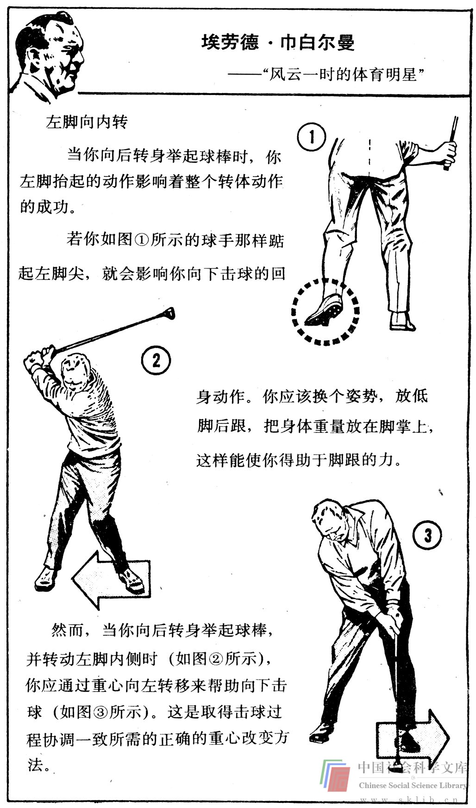

# 第一章 导言

无论从知识还是从机能方面说，人的学习潜力都确实非同寻常。人脑所能贮存的信息量大得惊人。而人作为魔术师、特技飞行员或音乐家、其活动的能力同样是非凡的。人的有些机能，如血液循环和感觉冷暖，尽管极其复杂，却无需有意识地去学，它们是自动的。其它的如说唱和奔跑，则差不多是本能的要求，容易学会。但若要达到杰出的水平，就需要付出相当大的有意识的努力。再比如打网球、鞣制皮革、园艺、下棋、滑翔运动和阅读，都必须付出有意识的努力。

那么思维呢？它当然是人的一个最重要的机能。它是动的，还是有意识地学会的呢？提高一个人的技能的由来已久的方法是始终注意他的动作，并通常按照某种理想的典范、或标准来寻求改进它。热衷于高尔夫球的人，先学习怎样打高尔夫球，而后不停地实践，对照典范来检查他的动作和姿势，阅读论述高尔夫球的书籍和报刊专栏，并观摩其他更老练的高尔夫球手打球。

进行思维的人也应该这样做吗？我们应当学习所有能得到的有关思维的东西，然后去实践并检查我们的结果吗？我们应该将我们的思维同有经验的思想家的思维加以对比吗？下面有关美国生活的普通画面是帮助高尔夫球手改进动作的一组图片中的一部分。

你见到过类似的对思维的描述吗？我们都是有思维的人。但令人吃惊的是，我们大多数人竟然意识不到自己的思维过程。当我们谈到提高智能时，我们通常指的是获取信息或知识，或指人们所应该具有的思想方式，而不是指头脑所实际进行着的活动。我们并没有花时间去体察我们自己的思维，并把它与更成熟的模式进行比较。