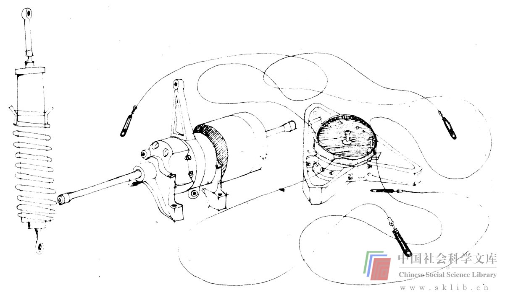

# 并不存在的问题之解决方法

在解决问题时，我们也会遇到关于实际上并不存在的问题的解决方法：下图中描述的物体说明了这一情况。它们是减慢宇宙飞船太阳板开启的装置。右边的两个物体是由一个极有能力的小组（我是其中一员）研究开发的，这个小组负责研制飞往火星的宇宙飞船——水手4号。水手4号由4块太阳板提供电力，在发射过程中这些太阳板被紧紧地拴在一起，然后由弹簧调节器松动和开启。由于它们被易损坏而又昂贵的太阳板吸热元件所覆盖，因此习惯上要使用一种装置来减慢它们的开启。

图中左边的物体是成功地用于早期登月宇宙飞船的一种装置。但是，它过于沉重，而且火星宇宙飞船的设计者并不信任它。因为它被注满了油，在飞抵火星的9个月的旅程中，有可能使宇宙飞船蒙上致命的油污。图中间的物体是解决这一问题的第一个方案。遗憾的是，尽管它不装油，却极为复杂，而且并不比前面的那个减速器轻。其复杂性和大量实验结果使得无法采用它，因为它缺乏可靠性。

右边的物体是第二种解决方法，这是控制所有4块太阳板开启速度的主减速器。尽管它被注满了油，但不会渗漏，而且这种装置重量较轻。但是，当最初研究开发时它也被证明是不可靠的，因而使这项工作出现了全面的恐慌。不再有更多的时间去尝试第三种方法了，因为行星宇宙飞船不能被耽搁（在下一次有利的太阳系行星组合——这通常在几年之内是不会出现的——到来之前，抵达行星就会困难得多）。因此，为努力提高调速器的可靠性，发动了一场耗资巨大、不分昼夜的紧急行动，同时还搞了一个模拟试验项目，测试飞行中可能出现的各种故障的有害影响。

调查出的故障之一是减速器完全不能减速。令人十分惊奇的是，这一结果却使人喜出望外。因为实际上根本就不需要这个减速器，而有可能让太阳板自由开启并在旅行终结时用能量吸收器吸收能量。因此问题的最终解决方法恰好可以由图中没有的第四种物体加以说明。因此水手4号未带减速器而飞往火星——这是解决这个问题最出色的可行方法。

这个故事的寓意是明显的。这项工作的进程在时间上明显不足，加上那些解决问题的人急于求成，便忽视了本来能够防止无益举动的可供选择的新思路（如无需减速器）。

这种打一枪换一个地方的方法之效果的例子，在其它领域比比皆是。最有戏剧性的或许是，匆忙想出并实施解决办法，结果带来的问题比所需解决的问题还要多。许多这样的例子在环境领域已经引起了人们的注意，适用于那些由于环境的冲击而致力于环境保护问题的人的规章制度由此而生。这类法规中有一部分肯定将是有益的，因为它要求在执行一种解决方案之前应把大量精力投入思维创新过程。在从阿拉斯加北部向美国其它地区输送石油问题上所产生的大量想法，如果没有政府的压力就可能不会出现，这种思维创新过程对于解决方法的质量是有益的。

对于从阿拉斯加运油和粉刷浴室来说，对于设计宇宙飞船和带领全家度假，以及对于环境保护和家庭收入开销来说，丰富而有创造性的思维创新能力都是同等重要的。我相信，思维创新过程是一个普遍的过程，在设计一种富有营养的食品和设想一个更好的利用超声波扫描心脏的方法时，会出现同样的问题。

进行良好的思维（仍然象打好网球一样）需要无意识地做出许多决定。在一个人试图完成一次困难的击球时，有意识地考虑身体各部位的适当位置，对打好这个球并没有帮助。同样，通过有意识地挑选每个策略并在心里作出一般的判断，也不能帮助一个人进行良好的思维。但是，正如在打网球时，你对不同策略的谙熟能使你不加思索而运用自如那样，思维亦是如此。

随着本书的深入，我希望使人们更多地意识到创造过程，意识到阻碍它的各种障碍和各种可能增加其困难的陷井。尽管这不是一本心理学著作，但书中将对一些有关创造力的基本理论进行扼要的探索。这些理论上的阐述尽管有趣但并不完善。因此，并不存在什么能使每个人成为高超的思维创新者的特殊思维模式。一些技术和方法对某些人很起作用，却令另一些人讨厌。如果你读到对于自己来说毫无意义的技术和练习，就跳过去。（我希望）你不久将会发现能够提起你兴趣的技术和练习。

当一个人要进行创造性的教学时，总会提出这样一个问题：“创造性是可以教授的吗？”显然我认为它可以，否则我便不会写这本书了。这种教学可能更具有激励性，也可以按你的见解称呼它，我相信我们在斯坦福大学的努力促成了学生思维创新成果质量的提高。另一个经常被提出来的问题是：“有意识地变得富有创造性，这种努力会妨碍创造性过程吗？”这将在第三章予以更详尽的论述。简短地说，这一答案并不复杂。如果达·芬奇碰巧读到这本书，那可能会浪费他的时间。但是我们中的大多数人并不是达·芬奇。

关于创造性的最早的一种理论认为创造性是神的火花，柏拉图曾这样谈论诗人：

> 由于这一原因，就象对预言家和伟大先知们所做的那样，上帝剥夺了这些人的思想，并使之成为自己的圣徒，以便当诗人们发狂时，倾听他们心声的我们可以知道，并不是他们本人说出了极富价值的话，而正是上帝自己借诗人之口向我们吟诵。

然而，对于我们大多数人来说，创造之火比神的火花要暗淡的多。但它受到较多的煽动时，将燃烧得更明亮。