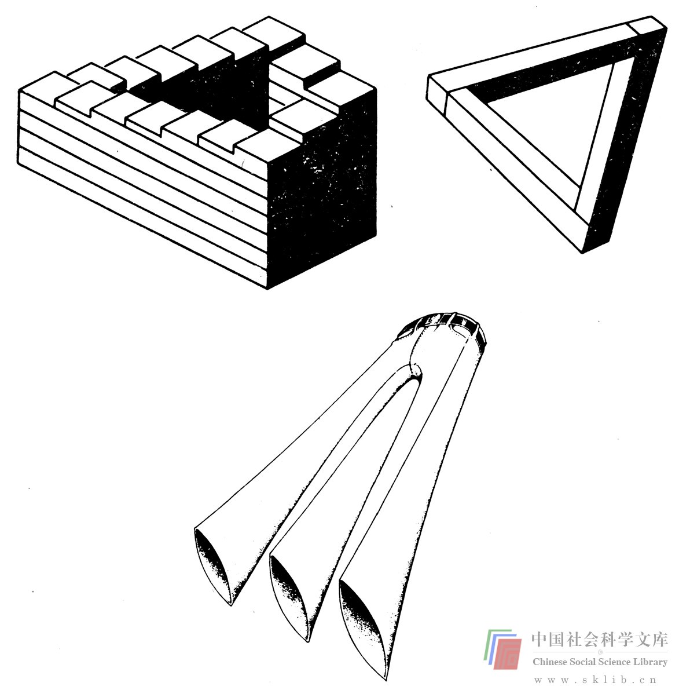
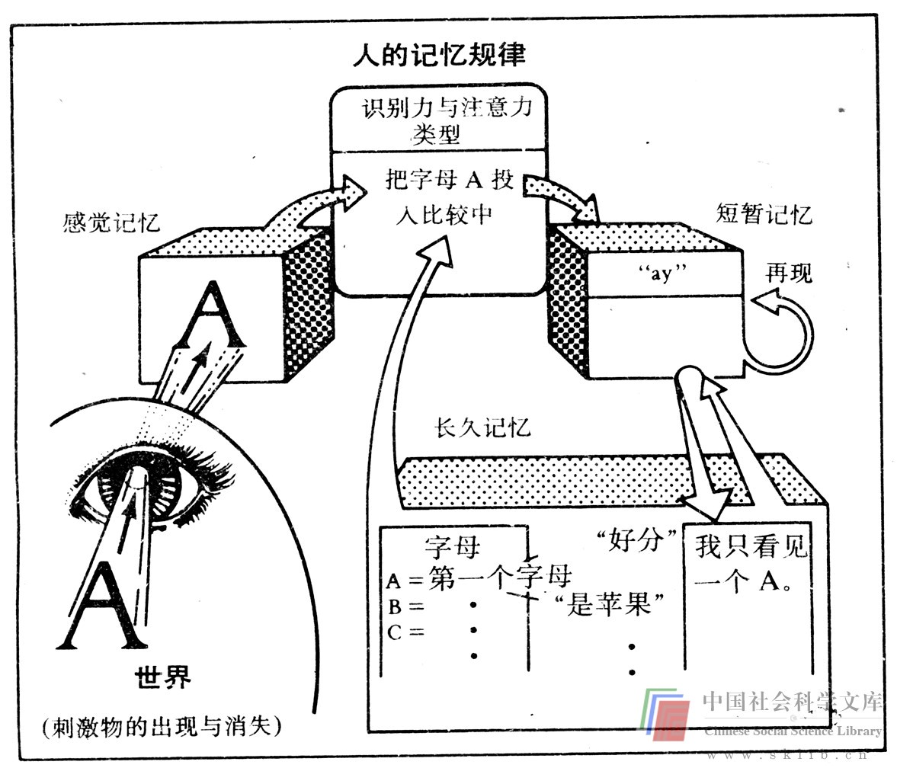
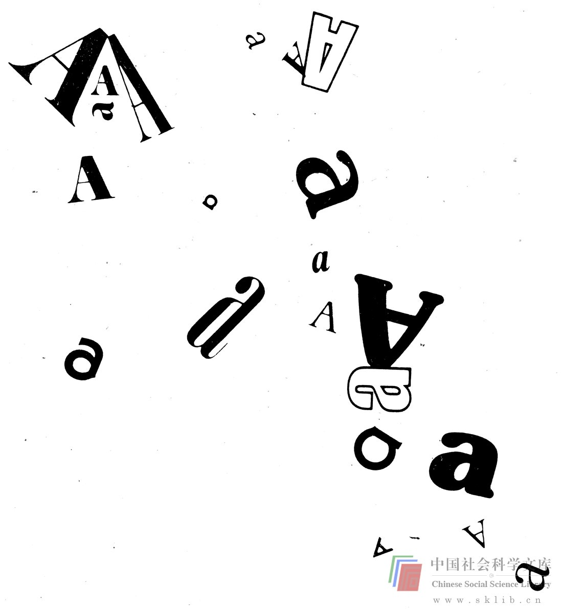
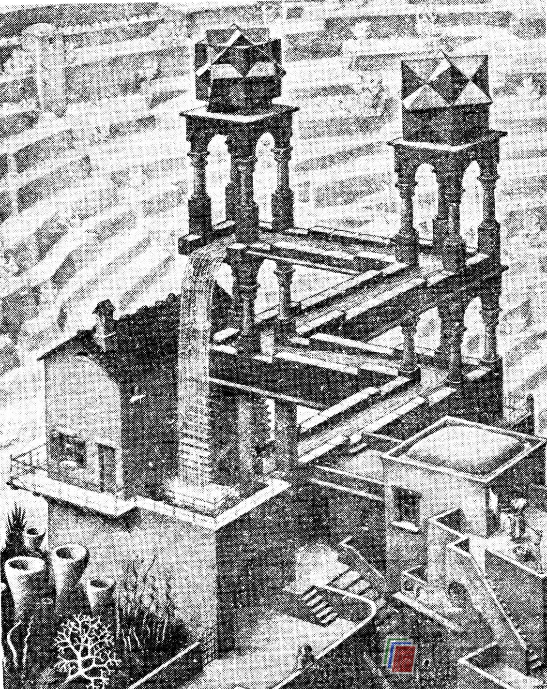

# 观察中的先入为主——成见

20多年来，我们一直被提醒存在着成见。少数种族集团成员、妇女、同性恋者、老人、残疾人及其他人都深刻地教育了我们：任何社会偏见都是错误的。但是，陈腐观念仍在我们的生活中起着巨大的作用。假如你是一位男性，设想你穿上了高跟鞋，人们会有什么样的感受呢？又假如你是一位女性，刚点燃一支烟便去进行业务洽谈，人们又作何感想？成见和贴标签是极其盛行的、强有力的感性障碍。其道理是简单的：如果你先入为主，你就难以明察秋毫。

举一个成见之影响力的例子。我戴过领带，但不喜欢它，一度曾打算永远不戴了。然而，我发觉这是自己和自己过不去。由于与领带有关的陈规俗套如此强大，唯有戴领带方能顺利完成工作上的事情——因为人们把我当成了举足轻重的人物。

感性方面的成见部分地说明了各种视错觉的产生。

感性方面的成见也并非全是消极的，因为它也允许人们对不充分的材料加以充实。但它却可能是新的感觉组合的严重障碍。创造力有时被定义为将似乎互不相干的部分结合成一个有机的、有价值的整体，而对那些表面互不相干的部分的陈旧概念则妨碍着把它们结合为一个新的整体；在这个整体中，它们也许会发生相当不同的作用。

一种标签（教授、家庭主妇、黑色、椅子、蝴蝶、汽车、轻泻剂）一经使用，人们几乎就不可能再会注意被贴上标签的事物的实际品质或属性。譬如，我试着想出一把椅子的用途。如果我仅仅把它们看成椅子，就只能指出诸如坐在上面、站在上面或在B级电影中用来袭击歹徒这类用途。但如果我想到椅子的各种属性（构造、垫料、木腿、螺丝等等），就能说出它更多的用途。也许我可以拆开这些椅子，将座位卖给观看足球赛的人，用椅子的皮罩做钱包，把螺丝当小零件卖掉，把木头卖给家庭工匠。先入之见却压制了这类思维。

不幸的是，成见内在于心理活动之中，许多用来形成概念的信息都是先被记录在记忆中然后再现的，而不是获得信息后立即使用的。记忆不可能贮存感觉所接受的全部原始信息。大脑通过滤出被判断为无用的信息，将余下的有用信息尽可能地与已经贮存在记忆中的信息相一致地进行分类。当信息在以后再现时，它便是一种简化的、规范化的形态——在某种意义上说，即一种最初的成见。

下图是一名认知心理学家描述的大脑的信息加工系统模型。

这样的模型并不完全符合记忆规律。心理学家们甚至对被分别说明的功能各起各的作用这一观点也未取得一致的看法。但是，模型有助于理解。让我们简短地讨论一下该系统中的各个组成部分，以便更清楚地了解产生成见的过程。

模型中所显示的感觉记忆部分地以人体感官所接受的形式来保存输入的信息，并传给另一个部分。其间，一个把信息缩减为更概念化形式的认知——模式（pattern-recognition）过程发生了。例如，记忆的认知——模式功能使你能够从下面出现的光怪陆离的形式中辨出字母“a”（这显然是一个复杂的过程）。

信息在浓缩为更加概念化的形式之后，接着进入到瞬时记忆。瞬时记忆与能够贮藏大量信息的感觉记忆相比，所受的限制更多，但它却能把这种信息保存更长的时间（几秒钟）。

尽管瞬时记忆对于我们完成日常活动极为重要，但特别令人感兴趣的却是长久记忆，它使我们能够解决问题，能够表达感觉，赋予我们以自我感觉。进入我们感觉中的信息只有一小部分经由瞬时记忆而到达我们的长久记忆之中。注意力提供了长久记忆的聚集机制（focusing mechanism），在生活中，从事某项复杂工作时（如早晨驱车上班），长久记忆仅仅注意到来自感觉的一小部分输入。这类输入大部分只是浮掠过瞬时记忆。上图中从长久记忆上方指向认知——模式功能的箭头显示了这个注意过程。

正是长久记忆中已有的材料决定了注意力：记忆趋向于强化已有的材料。例如，如果你是位酿酒师，你就会记录所遇到的大量有关葡萄酒的新资料，以补充已有的丰富的知识贮存。同样地，你很少记录你不感兴趣的信息。如果你讨厌数学、你就不会去记录有关数学的新信息。这种倾向应当使你怀疑自己在记忆中再现的材料是不是包含你对所厌恶的细节的不偏不倚的描述（实际上并没有）。你还应怀疑到，在你并不看重或不愿思考的领域中，成见是否起着强有力的作用（确实如此）

到达长久记忆的信息必然被整理，这一过程取决信息的内容。下面的练习可以说明这一点。

> 练习：请一位朋友大声朗读下列每对词，每对允许用5秒时间，每组词用20秒。通过排练（对自己反复朗读），试着记下第一组的7对词。通过造出一个联系各对词的句子试着记住第二组词。通过在脑子里设计一个能够联结两个词的生动形象（越离奇越好）来记忆第二组词。完成之后，要求你的朋友只读每对词的第一个词，给大约5秒钟间隙，试着写出每对词中的下一个。然后检查一下你记住了多少个词。

>> 椅子——云 收音机——手 蛇——灭火塞

>>  餐叉——硬币 鞋——河 烟囱——船

>>  地毯——砖块 房子——臭虫 鼓——兔子

>>  凿子——牛奶 刀——花 国王——汽车库

>>  教堂——鸡蛋 盐——豆子 鱼——轮子

>>  女孩——书 疲劳——蜡烛 章鱼——飞机

>>  牛奶——星 沙发——车 牛——花

你所回忆起的这些词被成功地传递到长久记忆。这个试验并不简单。因为许多人在伴以视觉想象组织句子时又会默读句子。不过，人们在记第二组词时通常要比记第一组词顺利，并发现记第三组词更轻而易举。句子和视觉想象不断产生的广泛联系，帮助所获得的信息向长期记忆传递。

前后关系是众多记忆技术中的关键因素。最出名的技巧是“地点记忆法”。在这种技巧中，你首先选取熟悉的生活并记下其中的一些场景。为了记下一些内容，对每个生活场景中你所要记忆的某个内容加以形象化的描述。然后，只需在心里回忆这种生活场景即可帮助记起所要记忆的内容。请试试这个方法。这种技巧极为有效，对于那些具有良好的视觉想象能力的人尤为如此。传说西塞罗（Cicero）曾用这种方法记忆他在罗马参议院的演讲。还有一种说法认为，下面这段话就是根据这种方法产生的。“在第一个地方我们发现……，在第二个地方我们发现……，等等。”或许这是虚构，但这是一个多么有益的传说，因而它应当是真实的。

我们通常记得住有前后联系的信息，而这种前后联系本身也随着信息进入了我们的记忆。当以后我们为解决问题而再现信息时，往往伴有来自最初的前后联系的信息和感觉的痕迹。这使得概念形成过程变得复杂了；因为对那些残留的材料必须加以处理。假如你是在丧礼上初次接触管风琴音乐，那么以后你也很难想到管风琴音乐还可用于欢快的露天演奏。从某种意义上说，你对管风琴音乐已经有了成见。

信息是以一种结构化的方式由记忆加以整理的。它是按照相似关系分类的。想起“菜单”这个词，触发你想到别的什么词吗？侍者？蜡烛？葡萄酒？餐巾？许多刀叉？餐馆的其它情景？你想到蛇了吗？拖拉机怎么样？蛇或拖拉机是不太可能想到的，因为它们并不在你有关餐馆的档案里，记忆中结构化的信息对于你非常重要，所以你可能会消除那些同已存在的信息相矛盾的信息。心理学家论述了某种令人讨厌的内心状态，并称之为认识差异，它是由一个人的知识、知觉和行为之间的不连贯性造成的。个人企图缩小这一差异，而缩小这种差异的办法之一是贬低那些与自己成见不相符的信息。

谈了上述问题之后，我们稍加深入地观察一下用于人的标签。对于人，我们都带有成见，而这些成见往往会导致社会和个人问题。我是一名教授，你们中的绝大多数人从未见过我，那么你们会以“教授”的标签和你们的形成成见的能力对我作出相当多的定论。然而，尽管你们给我归纳的某些特征也许是正确的。但仅仅依靠那点信息与我共事或生活就必然会遇到麻烦，因为我有着我自己的一组特殊的特征。我是一名父亲，一个过得去的机修工、机械师和木工，一个蹩脚却热心的网球爱好者，一个比较好的篮球手和钢琴演奏者。象我在工作中接触的许多人一样，我乐意呆在农村而非城市，但喜欢一个轻松愉快的社交日程，我有一个不争气的膝盖，一个凌乱的办公室，一头灰发和一套1909年建的褐色砖木房屋。我身高6尺4，眼睛绿色，象部老掉牙的机器。我列出这些特点之后，你应当能够超越你已有认识的旧框框，将我作为一个人而有更多的感受。从而我们之间能够更加相互影响。这些补充的信息还丰富了你对“教授”已有的认识。现在试做下列练习，观察你如何给自己贴标签以及人们如何给你贴标签。

> 练习：找一些你不甚熟悉的人。每个人都构想一条描述你的标签，并把它告诉其他人（用几句话。花半分钟左右的时间思考别人的标签对你来说意味着什么。然后花5分钟时间口头交流补充的特性。轮流进行下去，不要闲聊（虽然这是诙谐宜人的）以避免交流信息。也不要向别人提问，不要试图操纵谈话，只交流信息。

你认为这个练习是发现别人情况的一条捷径吗？很多人认为是这样的。但是，你也发现这个练习是困难的吗？即使在度过较长而丰富的生活之后，人们也往往很少谈到个性问题，在偶尔谈到时，更多地是要找出自己的特点，而不注意别人身上的特点。他们常常还遇到无法抑制的闲聊的渴望。那么你呢？

在社会和职业的相互影响下，我们往往坚持成见和一般原则，除非它们在某些方面似乎触及了我们的切身利益。上述练习侵犯了我们的隐私，因为它迫使我们在可能准备这么做之前先泄露了信息。这个练习完成之后，绝大多数参加者一致认为，他们对别人的了解比他们最初从标签上获得的要多得多。他们还感到自身所抱有的成见对自己有很大影响，更加清楚地感到自己是如何墨守成规以避免承担社会风险的。最后还要说明的是，这个练习还表明，在我们的记忆中并没有关于自身特性的大量贮存。如果存在这种贮存的话，这个练习就会容易得多。我们不仅对其他人和事抱有成见，而且对自己也抱有成见。成见是明显的感觉障碍——也许是最重要的障碍。但是，还有其他的障碍，现在我们对其中的一些加以讨论。
