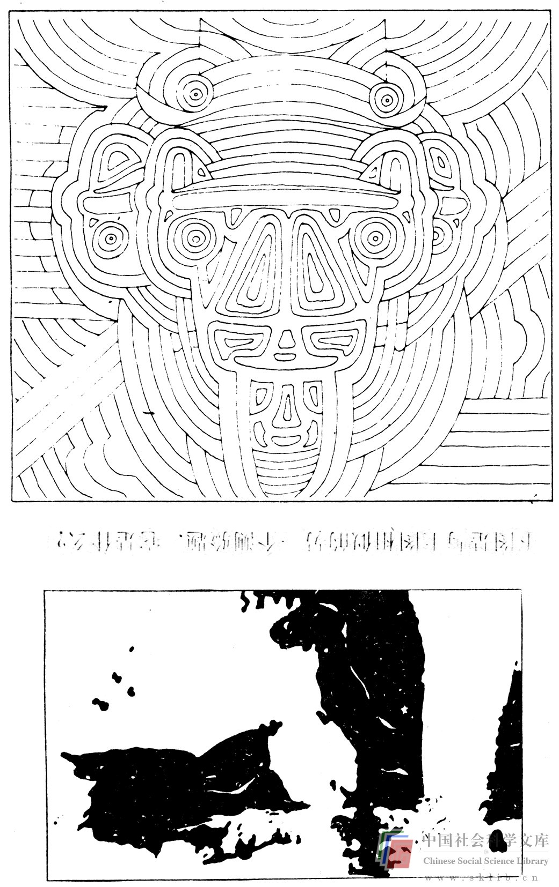

# 找出问题之所在的困难

你能说出下图表示什么吗？如果你以前曾见过，那么判断它就不成问题；如果你没见过，那就在往下看之前先识别出其含义（答案在后面）。

当然，这是一辆大众汽车。

现在，既然你看到了答案，就应当很容易看出这是一头牛。这是一例典型的视觉测验题，它要求解答者识别出明显的混乱中的含义。

我们所面临的问题可能是被不恰当的线索或引人误入歧途的信息所蒙蔽。在解决问题的过程中，恰当地识别问题极为重要。如果问题未被正确地分辨出来，它也就不可能得到正确的解决。成功的医疗诊断取决于医生从所获得的全部实际的和推测的繁杂信息中分辨出问题所在的能力。父母和十来岁孩子之间的融洽相处也需要这种能力以对许多显而易见的问题加以分辨，找出真正的问题所在。

你的问题实际上是汽油质量低劣，还是你的汽车需要计时器或新的仪表盘？也许你的问题是生活环境迫使你过分依赖汽车？问题的叙述通常是很自然地与答案联系在一起的。这些答案也许容易想到，也许难以想到；它们可能是对的，也可能是错的。象对“在厨房和餐厅之间的门上安装弹簧锁以使这扇门易于开启”这类建筑方面问题的途述，就表明了厨房和餐厅之间的通道是一扇门，而不是没有门，也不是对空间重新下定义，不是对准备食物与进餐功能重新定义。

如果你的职业就是专门解决问题的话，你就必须不断有意识地找出问题之所在。委托人、病人、顾客等都不可能永远清楚其问题何在。如果人们能够清楚地发现问题的症结所在，就能以一种较简单的方式排除困难从而迎刃而解。在工程学方面，人们有时全力改进某一机械，而忽视了解决问题的其它途径。许多人都致力于设计各式各样的西红柿采摘机。直到后来才有人断定，问题实际上并不在于需要不断改善西红柿采摘机，而在于采摘西红柿时它很容易受到损坏。彻底解决这个问题的办法是培植一种新品种，使它有较厚的皮，更接近于水果。

除了需要排除困难之外，问题的解决还常常受其他方面考虑的制约，这是显而易见的。解决问题的人必须意识到这一点。例如，假设我是一名咨询工程师，受某公司之聘帮助设计一种改进产品。该公司是地沟和排水管道清理机械的主要制造厂家。进一步假设，我发现问题在于使地沟和排水道总也不会堵塞。这一发现使我找到了一种更理想的方法，即通过综合地使用多种非常普通的化学品防止管道堵塞，它将废弃公司的生产线，且无需利用公司的竞争优势。尽管这样我将很自豪地成为一名成功的创新者，但我的老板也许不会向我支付酬金。如果你既要发现问题又要解决问题，那么正确地分辨出关键问题当然是同等（或更为）重要的。找出问题所在的困难在于人们为了尽快去解决问题的重要方面而往往极少去分析界定问题。要解决重大而复杂的问题却不去充分地分析界定它，这种作法是非常愚蠢的。花少量的时间分析界定问题对于启发潜在的解决问题的简便方法极有价值，并能保证不至于已经花费了很大努力，结果却发现问题仍然存在，甚至更为严重。

> 练习：找出一个困扰你的问题。尽可能简要地写出这个问题。你能想出同样会给你带来困扰的其他一些问题吗？若能，将它们记下来并揣摩出各种解决方法之间的差异。
