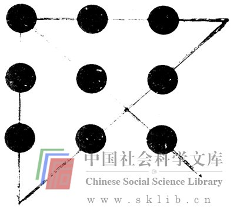
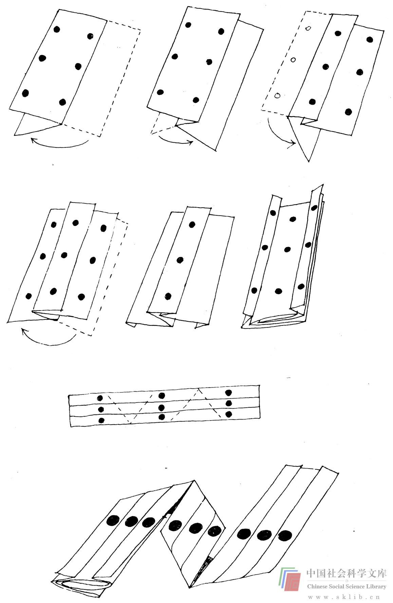
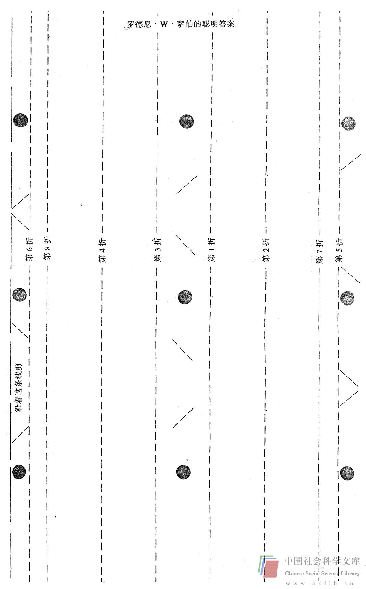
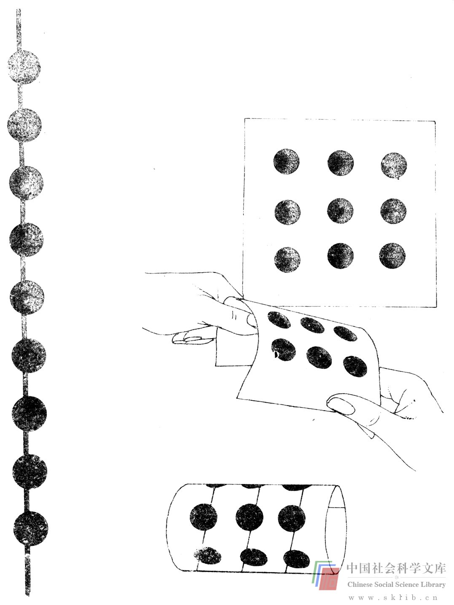
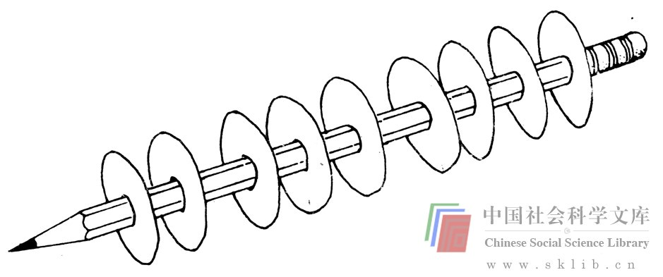
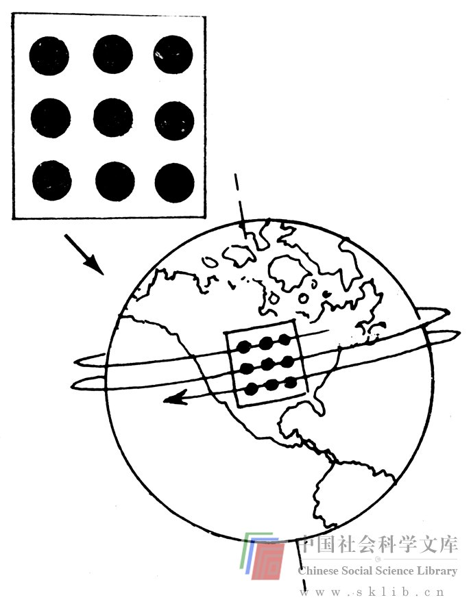
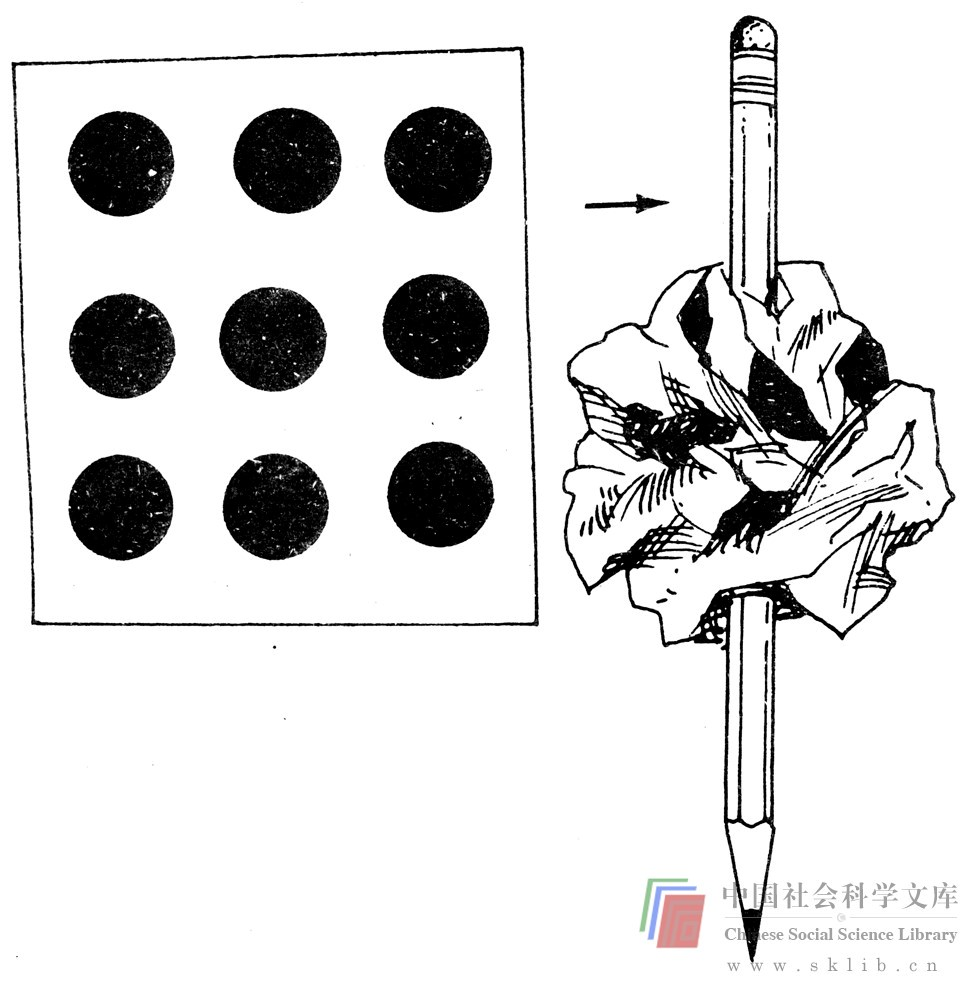

# 过分限定问题范围的倾向

正如有时难以恰当地找出问题之所在一样，避免过分限定问题的范围也同样很困难，换言之，人们不应当对它们强加许多限制。下面的普通智力测验题就是过分限定问题范围这种倾向的例子。

> 智力题：一笔画出4条能穿过所有9个点的直线。

> 

如果不突破假设的界线的话，这道题是难以完成的。下面是一种可能的答案。

由于这种限制通常不知不觉地存在于人们的头脑中，所以，尽管它根本不属于这个问题的限定条件，大多数人在解决问题时还是不能突破假设的界线。过分地限定问题的范围是解决问题者头脑里的障碍。这种障碍广为存在，而这个测验题是一个范例。

这样的障碍难以捉摸且随处可见。我曾在作“如何解决问题”这个专题的讲演时，散发了一种封面上附有这个测验题的通知。有人匿名寄回（坦白地说）下述答案。

我郑重地将他（她）称为思维创新的姣姣者，心里很佩服那个人。因为我确实还是受到过多的限制，没有认识到画线时无需直接经过这些点的中心。

如同在伤口上又撒了一把盐，我的一位老朋友后来送来了如下所示的绝妙答案。他通过折叠一张白纸，用一条直线就穿过了9个点。请裁开下页纸进行折叠，尝试一下这种方法。

我收到过许多下面这类答案，即只需把测验题裁开。用不同的方式将它们连结起来，仍是用一条直线。

还可能将测验题卷起来并画出一条经过各点的螺旋线（如下图），还可以用其他突破二维空间的方法。

到目前为止，我收到了许多答案，这些答案都是非常聪明的，我很懊恼自己从未想到过这样做。

1条线0折

把这张纸贴在地球仪的表面，环绕地球仪两周，当把地球仪向西转动时，每绕回一周移开一些，以便环线再过来时能经过下一排点。

2条线0折

把点尽可能地画大些，将纸卷成一个球，用铅笔戳。打开它，看看你是否完成了，若没有，再试试。“没有人会输掉：玩下去便会成功。”

下面有我所欣赏的一封回信。

> 亲爱的詹姆斯·Ｌ·亚当斯教授：
> 我父亲和我做了《突破思维的障碍》上的测验题，我们主要做了那些点线测验题，比如象

 
> 我父亲说有人发现了能用一条直线连接的方法。我也设法做成了，不用折叠，但我用的是一条很粗的线，因为并没有说做题时不能用一条大粗线。

> 另：实际上你还需一支很粗的笔。

> 你忠实的贝基·彼琪儿（10岁）

> 1974年5月30日

这种创造力的迸发是令人激动的。这本书的启迪之一，是我们给自己的活动设定了界线（点周围的栅栏），一旦认识到这些界线的存在，我们便有希望从中解脱，不再受其羁绊。9点测验题就是这一现象的明证。界线是可以跨越的。

正如一种解决方法易受是否恰当地分辨出问题的影响一样，它也易受划定的范围（限定）的影响。总之，问题所限定的范围越宽松，思维创新的天地就越广阔。要求设计一扇好的门，可能会产生一个带有绞链和把手的长方形厚板。这就是所要设计的吗？或许这个问题实际上就是寻找穿过墙壁的好方法？所要寻求的是穿过墙壁的好方法，明确了这一点，便使人摆脱了那种旋转的或滑动的长方形厚板的思维局限。让学生们回答这一问题时，他们将找出所有墙壁通道的几种形状的式样（弹性隔板，机械阀门，门帘以及精制的旋转和折叠机械装置）。这达到了要求吗？或许解决这个问题的关键是将其划入声学、视觉或环境的解决范围？如果简单地将问题定为“设计一扇更好的门”，那就绝不可能由此产生一种多功能的充气门帘，它既可以自由出入，又可以贮藏热量或者防止热气进入冷却设备。

如果你雇用一名建筑师或结构工程师或律师，你就得付给他酬金。如果你过于严格地限定某个问题（如“这是一项设计楼板和电梯的计划”——请设计出来），结果往往不能发挥他的专长。如果一个人既要找出问题又要解决问题，那么这个原则对于他也同样适用。对问题限定得过于狭窄会抑制创造力。

当然，也可能出现截然相反的情况。对问题的限定也可能会不够充分，结果是解决问题的方法过于一般化，没有多大针对性，实际上毫无用处。一个汽车公司寻找保持汽车挡风玻璃清洁的更好方法，就不可能在废除汽车上打主意。因此，恰如其分地限定问题的范围就成为一门关键的艺术。它能够使人在解决问题时最大限度地发挥其创造性的思维能力，同时得到有用的答案。但是，依我的猜测，陈述问题时更多遇到的是限制过分，而不是限制不充分。有感于此，并且由于这是一本论述创造性的书，因而在这里，更偏重于禁止强加过多的限制。

> 练习：下一次你遇到一个问题时，去解决它。然后在闲暇之际，至少列举出3种可能的问题界线和在每种情况下你所能得出的答案。例如，假设你已经年近40，你的孩子都上学了，丈夫正在自己的行业中有所建树，而你却百无聊赖。

你也许会把你的问题归为“难以应付现实世界”。你也许和几个熟人联系，打算在你所感兴趣的某个公司里找一份工作，在那些漂亮的、崭露头角的年轻人手下干活。过了几天令人激动的新鲜日子之后，反躬自问，你最初是否还可能提出另外的问题，如果可能，那结果又将怎样呢？大概会有以下几种情况：

1. 你可能会认为问题是“很难打发百无聊赖的日子”（限定范围很狭窄）。你本可以学几种技艺，积极地与人共进午餐，进入委员会，参加志愿活动，参加各种课程的学习。
或者：

2. 你可以将问题描述为：“现在抚育孩子、操持家庭的任务已基本完成，而你自己却缺乏一种充满竞争和有意义的生活。”（限定范围较宽松）然后你可能花费很多功夫设立自己的目标或前景，并决定如何去取得圆满成功，而最后你成了一名法律专业的学生。
或者：

3. 你也许会断定问题是：“角色的框框限制了妇女的自我实现”（限定更少）。你大概会同熟人、专业人员、教育机构的人员及其他人员交谈，并认为存在着大量的社会问题。而且你还可以组织一个城市范围或州范围甚至全国范围的组织，帮助象你这样的妇女更好地跨入职业世界。

由于定义问题的界线逐渐宽松，一个人常常遇到多学科的考虑：经济的、政治的和伦理的。如果你认为你的问题只不过是与“联邦政府的烟尘方面的规定保持一致”，你的答案就可能象是给现有的机器安上了一个小机件而已。但是，如果你发现问题是“减少空气污染”，你也许会考虑全面更新交通工具，并进行复杂的社会方面和技术方面的探讨。

