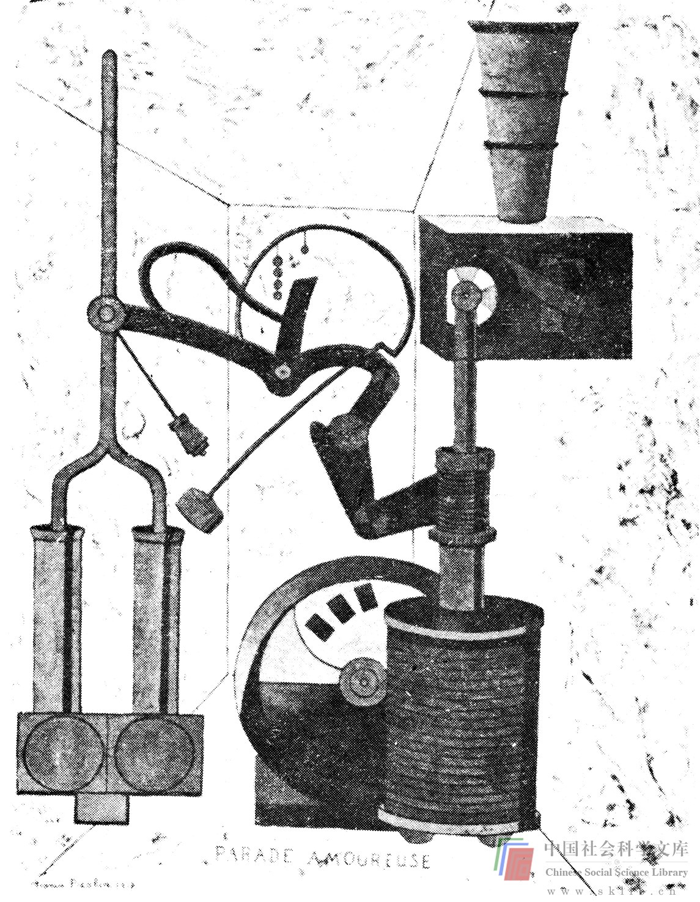

# 未能利用所有感觉输入的信息

所有的感觉都是以颇为直接的方式相互联系的。在第六章将对此进行深入讨论。视觉、听觉、味觉、嗅觉常常是相互联系的。如果嗅觉受到抑制，那么，味觉也会受到严重影响。同样，视觉主要凭借着声音而得到加强（如电影）。

各种感觉的输入（最明显的是视觉）对于极其富有创新精神的人来说是至关重要的。这在文献中有着大量的记录。在写给雅克·哈代马德的信中（摘自布鲁斯特·戈塞林主编的《创造的过程》），阿尔伯特·爱因斯坦说：“文字和语言，无论是书面的还是口头的，在我的思维组成部分的精神实体中似乎是某些可能‘自动’再现和组合的符号或者一些不甚清晰的意象……具体到我自身，上述这些成分均属视觉和肌肉感觉，只有上述的相关作用充分实现并能够按照意愿再生时，方可在次级阶段竭力寻找传统的文字或者其它符号表达形式。”泰斯拉，一位卓有成就的技术创新者（荧光灯、直流发动机、“泰斯拉”线圈），显然具有令人难以置信的形象思维能力，正象J.J·奥尼尔（O'Netll）在《伟大的天才：尼古拉·泰斯拉的生平》里所说的，泰斯拉“能够在眼前呈现一幅各个部分装配完整的机器的画面，这种画面比任何蓝图都更为清晰。”泰斯拉甚至声称能够在心里检验自己的装置，即通过使它们在想象中运行几个星期——在这以后他可以检验它们的磨损情况。

解决问题者需要得到各种帮助。因此他们应当细心留意一切感觉的信息输入。例如，一位研究音乐厅音响问题的工程师不应当只是迷恋于理论分析，而忽视考虑各种样式的音乐厅以及聆听一下每种音乐厅的音响效果。他还必须知道，尽管他的声响处理对耳朵来说是成功的，但是如果他选择的材料太过份，也许会过于刺眼，甚至使嗅觉不适。

因此，设计者们时而有意暂时忽视特定的感觉输入，以便充分地记下其它的输入。设计者准备用天棚代替遮荫树木，直到它们在新院子里生长得很高，他最好不仅观看树木，而且要留心听它们的声音，触摸它们，闻它们的气味，攀登它们，通常还要花相当长的时间与它们融为一体。在成功的婚姻中，一方不仅能敏锐地观察伴侣的外表，同时也对他或她的声音、气味、味道、感觉都非常留神。利用各种感觉信息是解决两人之间问题的最佳途径。

说服学生们尽可能地使用所有的感觉信息，是我们在斯坦福大学遇到的最困难的任务之一。大学生语言能力很强（他们入学的条件）而相对缺乏形象思维能力。他们不习惯于依靠味觉、嗅觉或触觉来解决问题。一般说来，他们熟悉利用文字或数学解决（他们这样认为）问题。他们在思考中通常不利用感觉的意象。这在第六章有比较详细的说明。在这里，我们不想费过多的笔墨。只是提到在解决问题时不能利用所有的感觉是相当普遍的思维障碍这一点就够了。

