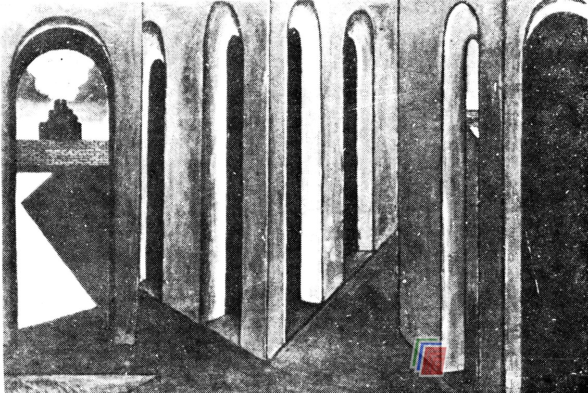

# 弗洛伊德

弗洛伊德的许多理论建立在原我（id，我们自身本能的动物因素）、自我（ego，社会意识及情感意识）与超我（superego，使我们自身受制约的道德因素）的矛盾冲突的基础上。在弗洛伊德模式中，“我”是原动力，它存在于人的潜意识之中，主管满足人的自身需求。按照弗洛伊德的理论，源于潜意识的想法必须受自我和超我的审视，并受其制约（“自我”可以否决这些想法，因为无法在现实中实施；“超我”也可以做否决，因为我们根本不该有这些想法）。假如这些想法被否决，它们要么就完全被压抑下去，要么就因冲突未得到解决而转变为某种心理变态举止。如果这些想法被“自我”和“超我”所接纳，它们便会进入我们的意识之中（而这种接纳也可能产生焦虑，一旦“自我”和“超我”认同某一想法，那便意味着“否决”会使人受到伤害）。若“自我”和“超我”的选择过于苛刻，那么进入到意识中的创造性思想就比较少；若选择过于宽松，那么极富创见而又极不现实的想法就会大量地涌现出来。

> 德·卡利考：《焦虑的旅程》1913年

自弗洛伊德以来，他的理论不断被其后继者加以阐释和发挥。劳伦斯·S·库贝（Lawrence.S.Kubie）写了一本题为《创造过程中的心理扭曲》的书，其中有这样一个很好的例子。库贝在他的创造性思维模式中运用了弗洛伊德的“前意识”概念，他把创造性思维的潜意识因素及解决问题的过程都归于前意识，而把下意识看作是未解决的冲突与被压抑的冲动的表现。在这个模式中，前意识心理过程受意识与下意识过程的制约。正如库贝在《创造过程中的心理扭曲》中所说：

> 前意识过程受到两方面的制约。一方面，它们受无意识需求的骚扰而成为一些僵硬的、扭曲的象征，这些无意识需求脱离现实，是一些缺乏创造性的折衷形态。另一方面，它们又受严格的有意识之目的的驱使，受有意识的反思批判的检验和校正。

与弗洛伊德同样，库贝也提出了一种心理模式，即创造性思维受有意识的自我和超我的制约，至少某些创造活动是在意识层之下进行的。然而，与弗洛伊德模式相比，神经官能症在库贝的模式中起了更坏的作用。