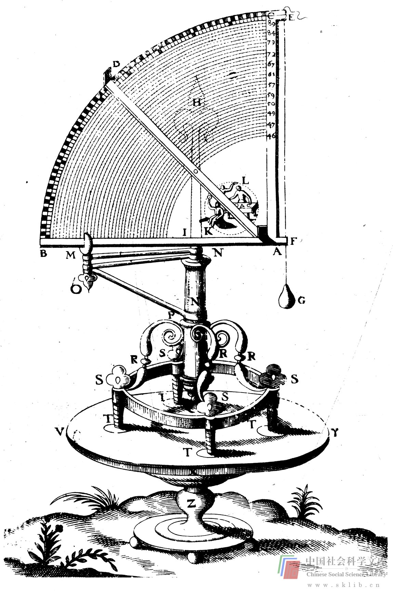

# 幻想与现实

“缺乏通往想象领域的途径”，“缺乏对想象力的控制”，“不能将现实与幻想区分开来”，我们将在第六章进一步探讨上述问题。简而言之，想象力是一种创造心理，它渴望创新。一个富有创新精神的人既要善于控制，又要充分发挥他的想象力。一个人若不动员他的所有感官（不仅包括视觉，还包括听觉、嗅觉、味觉、触觉）一齐参与想象，他的想象力就不能发挥到应有的极限。所有感官之所以都必须参加想象，不仅是因为这可以解决那些涉及到感官的问题，还因为只有在开动全部感觉器官的条件下，想象才来得更为强烈。比如，当涉及某一事物的形状和外观时，你若只用言语思维，就几乎没有用想象来解决问题。假如视觉参与进来，你的想象力就丰富多了，但仍不如全部感官一齐参与时来得更强烈。在你想象花园球场时，假如你这样想：青草散发出清新的气息，你坐在椅子上，一边享受着明媚的阳光，一边品着啤酒、花生，四周一片欢声笑语，你的头脑中便会呈现出一幅生动的画面。

一个富有创造性的人不仅要有十分活跃的想象力，还应善于控制它。创造力是对经验的控制和重新组合。不能控制经验的想象力，对于思维者来说是一种局限。假如你能最大限度地发挥你的想象力，你就应当想象在你的花园球场上什么事都可能发生，要么突然出现一座火山，要么一架飞机在那里降落，要么你的球场突然缩小了，而一片翠绿的青草竟变成了紫色的了。第六章里有几个练习，它们可以帮你测试你对自己想象力的控制能力，还将讨论如何强化用于想象的“智力肌肉”。

一个富有创造性的人应能够无拘无束、生动活泼地幻想，同时又能分辨幻想与现实。过于现实的幻想反而不易控制。当你做下面这个练习时，若没有产生极不舒服的感觉，你在区分现实与幻想方面便可能遇到一些困难。这个练习引自理查德·德·米尔（Richard de Mille）的《把你的母亲放到天花板上去》一书。你对每一情景（用分节号隔开）都作一番想象，直到在头脑中形成清晰的图象或感受为止。这个游戏叫作“气喘吁吁”。

> 想象我们面前有一条金鱼，鱼游动起来了。/鱼游到了你的嘴里。/深吸气，鱼进入你的肺，进入你的胸膛。/鱼在你胸内来回游动。/呼气，把鱼从体内呼出，它重新在室内游动。

> 将一群小金鱼吸入肺中，/它们在胸腔内来回游动，/把它们全部呼出去。

> 我们来看看，你可以把什么东西吸入胸腔，然后再呼出去。/吸进许多玫瑰花瓣，/呼出体外。/吸入大量水。/水在你胸腔内汩汩作响，/把水呼出去。/吸入一堆枯叶。/叶子在你胸腔内飞卷。/把枯叶呼出体外。/吸进雨滴。/滴滴雨水拍打你的胸腔，/把它们呼出去。/吸进沙粒，/它们在你胸腔内滚动，/把沙子呼出去。/吸进一把小鞭炮，/它们在你胸腔内噼啪爆响，/把烟和鞭炮屑呼出体外。/吸进许多小狮子。/它们在你胸腔内吼叫。/把它们呼出体外。/吸入火。/让火在你胸腔内燃烧，噼啪作响。/把火呼出体外。/吸进几段木材。/在胸腔内点燃木材，/让它们在你体内熊熊燃烧，呼呼作响。/把烟和灰烬呼出体外。

> 想象你面前有一棵大树。/你向大树喷一口火，把它烧成灰烬。/想象你面前有座城堡。/你向城堡喷一口火，彻底摧毁它。/想象你面前有一片汪洋大海。/向海中喷一口火，使它枯竭。

> 现在你还想吸进什么？/那么好吧。/又想吸进什么？/那么好吧。/你喷一口火，还想把什么烧成灰烬？/那么好吧。

> 想象你是一条鱼，/在汪洋大海中，/你不断地把海水吸进呼出。/你觉得怎么样？/想象你是一只鸟，/翱翔在空中，/你把冷空气吸进体内，然后呼出。/你觉得怎么样？/想象你是一匹骆驼，/在沙漠里，/你不断地把沙漠里的热风吸进呼出，/你有何感觉？/想象你是一个老式蒸汽机车头，/你向周围喷吐蒸汽和烟雾。/这会怎么样？/想象你是一块石头。/不要呼吸。/你觉得怎么样？/想象你是一个男孩（女孩）。/不断吸进呼出室内空气。/你感觉如何？

把沙子吸入肺中肯定不舒服。你能否想象出吸入沙子的感觉，这在某种程度上取决于你的幻想力。想象一下类似举动于你丝毫无损，你所感受到的痛苦是想象出来的，并非现实的。但是，如果幻想与现实在你头脑中混淆不清，你就很难想象出这类举动所产生的感觉了。人可以具有超常的想象力，因为想象是远离现实世界的。然而，想象力必须超出那些现实的行为和事件所受的局限，才可以达到极为强烈的程度。

