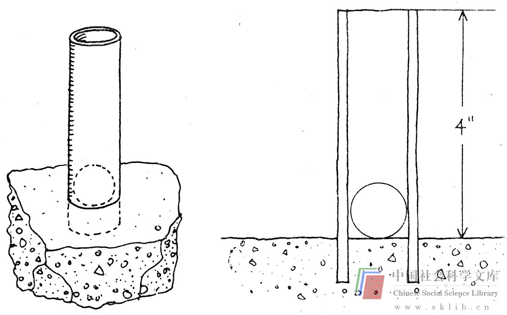

# 第四章 文化障碍与环境障碍

一定的文化模式造成一系列特定的文化障碍；而我们自身所处的社会和生活环境又造成了环境障碍。这两类障碍有某些内在联系，因此将它们放在一章内讨论。下面是文化障碍（就美国文化而言）的一些具体表现：

1. 禁忌

2. 幻想与沉思是浪费时间，是懒惰，甚至是疯狂的表现。

3. 只有儿童才需要娱乐。

4. 解决问题是正经事，用不着幽默感。

5. 推理、逻辑、运用数字、实用、务实是好的；感情、直觉、定性判断及愉悦是不好的。

6. 更偏好传统，不求变革。

7. 任何问题都可以用科学思维和大笔金钱来解决。

以下是环境障碍的部分实例：

1. 同事间缺乏信任与合作精神。

2. 独断专行的老板只看重他本人的意见，不会奖励他人。

3. 分散你注意力的原因——或是电话，或是他人的干扰。

4. 缺乏使思想变为行动的有力支持。

我们首先讨论文化障碍。我们从解决一个问题入手，这样可以阐释得更清楚些。

> 练习：如下图所示，假设一只钢管插在一间空屋子的水泥地面上，钢管的内径比一只乒乓球的直径（1.5英寸）大0.6英寸，一只乒乓球落在钢管底部。

> 室内连你在内共有6人，你们现在有如下物品：

> 100英尺长的晾衣绳

> 一把木工锤

> 一把凿子

> 一把锉刀

> 一只金属衣架

> 一把板钳

> 一只灯泡

> 

> 现在要把乒乓球取出，但不得损坏地板、钢管和球本身。列出你在5分钟内想到的全部解决办法。

J.P.吉尔福德（J.P.Guilford）是研究人的创造力的先驱者之一，他对思维的流畅性和灵活性做过多次阐述。思维的流畅性是指在一定时间内一个人可以产生多少种想法。假如你思维敏捷，你就可以列出一连串将球从钢管内取出的办法。但是，方法之多少只是此练习的部分内容。思维的灵活性是指想法不拘一格。假如你思维灵活，你就会想出各式各样的办法来。你若想到把金属衣架锉断，将断开的两端磨平，做成一把大镊子把球夹出来，你就找到了一种办法，但却是极普通的方法。假如你想到用板钳将锤子的把柄凿碎，用碎木屑填充钢管而把球取出，这便显示出你的思想具有更多的灵活性，因为常人一般不会想到把工具捣碎，然后再利用它。

你是否想到要每个人都往钢管里小便呢？假若没想到，原因何在？恐怕这就涉及文化障碍了。这里有一种禁忌，因为在美国，人们通常只在厕所里小便。