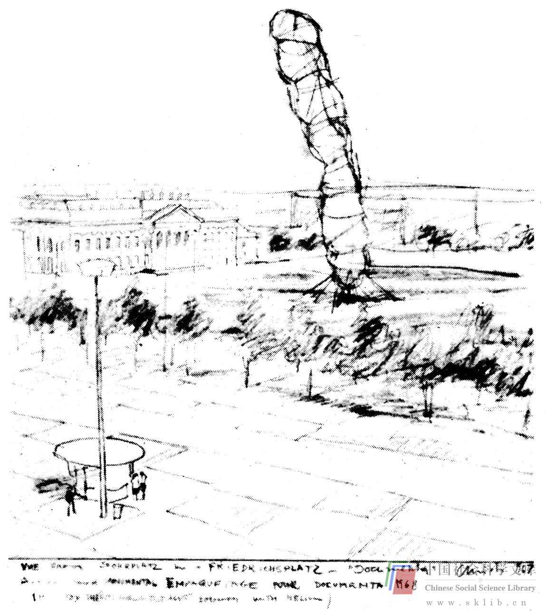

# 缺乏支持

缺乏使一种想法得以实施的物质、经济或组织方面的支持，这是另一个常见的问题。要把新思想付诸实践是极其困难的。完善并推广一种想法，要付出极大的努力。譬如，许多科学上的思维突破就需要多年的艰苦奋斗，才能引起科学界人士的关注。一本小说与激发灵感的最初想法相距甚远。而当想法形成一种完善可信的形式之后，仍要把它兜售给一个对它往往充满怀疑的世界，这可能需要金钱和时间。我们再以发明者为例。个体发明者与获得社会资助的发明者相比，其明显的劣势在于：他可能需要制作方面的资助，他可能希望搞到某些实验设施，或许还需要法律及推销方面的专门知识，而当他进行发明创造时，还需要经济来源以维持他的家庭生活——购买食品、交付房租等等。假如缺乏时间和财力保障，任何最出色的想法都会因无法实施而付诸东流。

发明者就算是个极特殊的例子吧。然而，即便创造一种新烹饪法，若没有钱来买各种配料，没有时间去做的话，也等于空话。一种创新的作画方法若没有绘画用具以及时间的保障，同样毫无结果。改善夫妻关系的设想（如共同外出度假）也需要时间和财力。一切想法都需要特定的环境，使它们从中得到实施过程所必需的各种资助。这种资助可能来自。对你友善的投资公司，你的银行，你的担保人，你的工资结余，或者任何其它赞助形式。缺乏这类赞助是影响极大的环境障碍。

