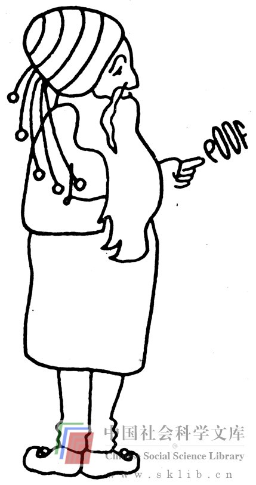

# 选择正确的思维语言

我们再次试问，你怎样选择你的智力策略呢？你怎样决定采用哪种方法来解决问题呢？视觉方式、数学方式，还是其它方式？假如你在我们提到的“和尚谜语”中选用了视觉方式，那么你是有意识地做这种选择的。假如你的确从这本书中得到了某些启示，你就会有意识地想到解决问题的多种途径，然后择其一种。然而，我们当中不少人也许会无意识地选择某一种策略，然后又无意识地从这一策略转向另一策略。如前所说，大多数人在解决问题的过程中都采用这种习惯模式。未经有意识的思考，头脑中也会产生某种意向。这种意向或许正确，或许不正确。假如它是错误的，那么另外一种意向或许还可以产生，或许无法产生。

有意识地思考一下你可能采用的多种思维语言，也许有助于你选择策略。比如，你看到那个折纸题目就对自己说：“啊，这家伙向我贩卖视觉思维。我可以用视觉语言解决问题吗？我先试着叠几下（很难继续下去）。还能试试别的方法吗？用文字语言表述？恐怕行不通——因为这是涉及到数量的具体问题。嘿，数量——采用数学语言怎么样？”这时，你要么用心算法找到答案（你是内行），要么列出方程，再解方程（你是个半内行），要么找你认识的懂数学的人帮你解决问题（你对数学只能算个业余爱好者了）。

下面是另一道智力题。在你设法找出答案之前，仔细考虑一下用哪种智力策略最合适，然后以最适宜的思维语言解决问题。

> 练习：一男人与一女人并肩而立，他们开始迈步时同时用右脚先着地。女人每走三步，男人只走两步。当男女二人左脚同时落地时，男人走了几步？

这是可以用视觉思维语言来解决的典型的例题。与别人在一起的实际经验、绘图或模拟音乐节奏等方法都可用于解决此题。也可以用数学语言，尽管绕了点弯子。用言语表述恐怕仍然行不通。你采用哪种语言进行思考？行得通吗？你尝试过不同方法吗？你怎么知道什么时候该放弃某种方法而试试另外的方法呢？这个问题的答案是，男女二人永远不会同时左脚落地。

选择适当的思维语言解决问题之所以困难重重，不仅因为选择过程往往是无意识的，还因为我们的文化过于看重文字思维语言（数学语言仅次之）。上述两个问题的难点在于，它们都不大容易用文字思维语言去解决。用绘图来体现的视觉思维几乎是解决具体设计问题的基本方式。其中一个原因是，当你用文字思维去思考具体设计问题时，你便产生了一种错觉，你以为自己有了答案，而实际上并没有。那些擅长言语表达的人喜欢讲一般笼统的大道理。在设计中，除非你以视觉模型为依据，否则你无法知道你的想法究竟是对的还是错的。

我们还可以把解决问题时不会灵活运用策略或采用不适宜的策略看作一种知觉障碍。由戴维·斯特劳斯（David Straus）和迈克尔·多伊尔（Michael Doyle）组建的“互促会”曾一度探讨过如何有效地运用思维策略问题。“互促会”将会员分成几个解决问题的小组进行训练，设置教育课程，并对解决问题的研究工作加以指导。这个组织出版了一份《基本概念提纲》，其中有这样一段话：

> 我们所制定的解决问题的每个具体行动或过程，都包括在更为一般化的、用于解决任何问题的思维方式之中。这就是隐藏在你行动背后的理性或目的：即与“什么”相对应的“为什么”。我们把这种一般意义上的思维方式称为“策略”。在我们的理论中，某一策略之内在的思维方式是独立的，与具体情境无关。换句话说，策略可以用于解决几乎所有类型的问题。我们可以看到，注意选择策略是解决问题过程中所使用的最有效的方法之一。

“互促会”成员确信，有意识地采用某些特定的思维策略是行之有效的。他们与教育界、商业界及政界的一些解决问题小组一起工作。他们在小组里推行的一个主要方法是，在解决问题过程中密切关注某一策略或某些策略的施用情况，而当解决过程陷于停滞或忽略了某些可能采用的方法时，应提出修正补充意见。在《策略手册》中他们提出了66种策略，并附有对每一条策略的解释、其优缺点及示范练习。下面便是《策略手册》中列出的某些策略和一个示范练习。

> 建立　　　展示　　　促进

> 排除法　　组织　　　检验

> 前进　　　列表　　　娱乐

> 后退　　　检查　　　操纵

> 联合　　　图示　　　复制

> 分类　　　图表注明　阐释

> 规范化　　文字表述　变形

> 示例　　　视觉想象　翻译

> 比较　　　记忆　　　扩展

> 联系　　　回忆　　　减少

> 实施　　　记录　　　夸大

> 区分　　　补救　　　掩饰

> 跃进　　　调查　　　适应

> 抑制　　　选择　　　代替

> 集中　　　计划　　　联合

> 释放　　　预言　　　分离

> 强迫　　　假设　　　改变

> 放松　　　提问　　　多样化

> 作梦　　　假想　　　循环

> 想象　　　猜测　　　重复

> 清洗　　　界定　　　系统化

> 酝酿　　　象征　　　放任

### 排除性选择

**可行性** 排除法的可行性在于，你可能更有把握确定你不想要什么，而不是你想要什么。这一策略要求：开始时供你选择的东西比你最终需要或想要的更多，然后根据既定标准不断排除某些因素。这一策略具有可行性，因为当你确定你不想要什么的时候，你不会过分扩展你的想法。

**局限性** 这一策略假设，在你进行思考的可能性范围内有一种好的解决办法。然而，当你做了排除之后，可能什么也没剩下。另一个难点在于，你很容易推论说，你想要的正是与你所排除的相反的东西（就是说，假如你不喜欢下雨，你必然喜欢晴天，因而排除了下雪、下雾或冰雹等其它可能）。因此当你进行排除的时候，必须小心谨慎，要有很好的判断力。

> 练习——我有宗教信仰了 要小组成员都来思考某一宗教问题、每人必须就此问题提出个人见解或某种联想，并把所有想法都记录在案。当大家对讨论结果感到满意，再也提不出更多看法时，让每人拿一张纸，一只铅笔，重新审阅一下记录，从中划去那些不符合他们个人宗教信仰或人生哲学的想法，并把做了排除之后剩下来的想法抄在纸上，把纸片贴在一块展示板上，以便相互交流思想。这一练习的好处是，每个成员都可以运用排除策略亲自参与问题的讨论。对这个练习还可以做适当修改，围绕若干问题进行讨论。在人文科学或比较宗教方面的学习班开始时做这个实验，可能效果很好。

书中有解释及示范练习，大多数人觉得并不难理解。实际上，人们大都不自觉地运用这些策略。但是，我们往往习惯做下意识的选择，而当我们的头脑熟悉这些策略并对它们作有意识的、或者借助外力的选择时，才能在解决某一特定问题的过程中最好地运用它们。“互促会”出版的《过程笔记》在前言中对这一状态作了如下描述：

> 我们运用思维工具解决思维任务，正如我们用物质工具解决物质任务一样。你要使自己熟悉某件工具，你就要试着使用它，看它在不同情况下能干些什么，判断它的用途。这一方法也适用于思维工具。我们的思维能力取决于我们能在多大范围内运用思维工具及使用的熟练程度。

显而易见，对思维模式及策略的自觉选择必须恰到好处。你不该用95%的精力去选择策略及思维模式，而只用5%的精力去解决问题。然而，花一定时间有意识地思考一下策略问题是必要的。首先，当你有意识地做选择时，你往往会发现一些新方法，那是当你下意识地选择策略时永远也发现不了的。其次，假如你熟悉这些思维策略，知道它们起什么作用，知道怎样运用它们，当头脑充分发掘它潜意识中的选择方法时，你就有把握使自己有较宽的选择面，你就基本上可以独立解决问题了。