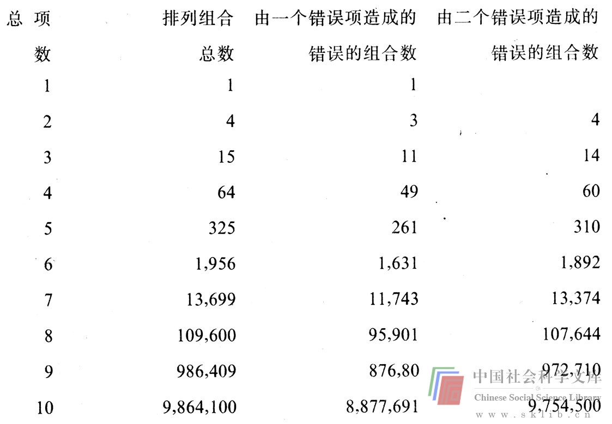

# 获取正确信息极其重要

缺乏信息或信息不正确，这是第三种智力障碍。正如我们前面讨论过的，阿瑟·凯斯特勒在“创造力之三范畴”中曾说：“创造行为就是把先前毫无关联的结构以这种方式结合起来，即你可以从一个浑然整体中获得比你投入的成分更多的东西。”其它一些有关创造力的定义也强调了这种“结合”。显然，我们必须占有可以结合在一起的成分（信息）。但是，让我们来看一看，假如我们占有某些不正确的信息会产生什么结果。我们来思考这样一种组合情况：每一成分只出现一次，并遵循一定的结合顺序。

如果我们把两个数字（a和b）结合起来，可得到四种结果（a，b，ab，ba）。假如a不正确，那么其中三种组合就是错的；假如a和b都不正确，以上四种组合就都错了。我们若把三个数字（a、b、c）结合起来，可得到15种结果（abc、acb、bac、bca、cab、cba、ab、ba、ac、ca、bc、cb、a、b、c）。假如a不正确，那么有11种组合是错的；假如a和b都不对，就会有14种不正确的组合。稍稍运用一些数学知识，我们便可总结出产生这类错误的一般表示方法。

让我先同那些学过数学的人简单复习一下曾学过的内容，这对没有数学知识的人或许也有启发。假设我们一共有n项，我们看到，若每组只包含1项，可得出n种排列组合方法；若每组包含2项，便有n（n-1）种排列组合方法；若每组包含3项，便有n（n-1）（n-2）种排列组合方法，以此类推，直到每组包含所有n项为止，这时我们得到的排列组合是n！即：n（n-1）（n-2）……（I）。这样，n项的排列组合总数（N）为上述算式的总合，可以用这样一个数学公式表示：

N＝n+n（n-1）+n（n-1）（n-2）+…+n！

例如，当我们有4项时，可能有几种排列组合呢？结果是：

N4＝4+4（3）+4（3）（2）+4（3）（2）（1）＝64

我们继续看一下。利用这个公式不仅可得出n项的排列组合总数N，还可以计算出包含错误项时受到影响的排列组合数目。假如n项中有1项是错误的，那么正确的排列组合总数是由（n-1）项所组成的排列组合数。要想得知错误的组合数目，只要用N减去（n-1）项的排列组合数即可。例如，由2个错误项造成的错误的排列组合总数，可以用N减去（n-2）项的组合数。举个例子可以讲得更清楚。

假如n＝4，其中有一项是错的，我们可用下列方法计算出排列组合总数N中有多少个错误的组合：

包含错误信息的排列组合数＝N4-N3

＝〔4+4（3）+4（3）（2）+4（3）（2）（1）〕-〔3+3（2）+3（2）⑴〕

＝64-15

＝49，即49个错误的组合。

下面表中列出了一些数据，它向解决问题者显示了占有正确信息的价值。第一栏代表凯斯特勒先生希望我们将其结合在一起的项数，即n；第二栏表示由n项可以进行排列组合的总数目；第三栏数字表明，当n项中有1个错误项（a）时，共有多少种组合包含错误的信息；第四栏表明，如有二个错误项（a和b），共有多少个错误的排列组合。

这些简单的数据并不代表一种思维模式。我只想借此表明，当包含错误信息时，错误的排列组合数目的增长趋势是何等巨大。

由此看来，在解决问题的过程中，占有正确的和适宜的信息至关紧要。有一种智力障碍使解决问题的人无法获得有关的适宜信息，从而导致灾难性的后果。一位不熟悉机电工程的机械工程师，或者一位不熟悉机械工程的机电工程师也许会设计出一些不伦不类的东西来，比如一种机械电视装置，或者一种复杂的电力传动系统，而这种传动系统本可以用机械装置解决，造价便宜，也更经久耐用。一贯拒绝使用数学方法解决问题的人因不会运用数据而使其决策能力受到限制，正如那些忽视美学、情感及定性资料的作用的人，他们因不愿获取某些有价值的信息而使其决策能力受到了限制。缺乏美感的工程师可能设计出一些丑陋无比的装置，作为一个附带问题，这些产品甚至连销路都成问题。环境保护学者若忽视数据及统计学的运用，在解决环保问题时便无法提出更多、更新颖有效的措施来。

然而，信息在解决问题的各个阶段是否都同样有价值呢？对此尚有争议。一种思维学派认为，现存秩序对创造性思维的巨大压力是创新的一个大敌。这一学派认为：“假如你长期习惯使用斧头砍树的话，你就很难想出用另外的办法伐树。”我认识的一位创造性极强的工程师认为，工作时头脑应象白纸一样“洁净”，这点极为重要——他避免接触任何与其研究课题有关的现成资料。但是，我还认识另一位同样富有创造性的工程师，他却大力钻研与研究课题有关的，哪怕是稍有联系的资料（“混浊的”头脑？）。的确，假如你不知道斧头的存在，那么你在解决砍树问题时可能发明斧头，但你也可能根本想不到斧头有这种功能。

照我看，解决问题的最佳状态是，即便你头脑中已储备了各种资料信息，你仍能够用“洁净的”头脑去思考问题。当然，我是就我个人的习惯而言的。正如我先前所说，我并不凭借一时的灵感，而是一步一个脚印地解决问题。我获得的信息越多，占有的资料越丰富，问题就解决得越好。但是，有些时候，在解决问题的过程中与现有资料保持一定距离是必要的。比如，当涉及高技术、复杂的商业问题或人际关系时，显然需要大量的信息。然而，这样大的信息量往往使你看不到一些极微妙的解决办法。占有大量信息使你成为专家，而威廉·J·J·戈登（William J.J.Gordon）在《集体研究法》一书中这样评价了专家的见解：“对现存知识领域的专门性阐释包含某些惯例，它们使现实成为抽象的第二手资料。这些知识惯例会成为一座没有窗户的堡垒，它使你无法用新的眼光去观察世界。”

我相信，作为专家而又能以新的眼光去观察世界是可能的。你不会指望一个在与世隔绝的岛上长大的人去发明更好的开罐刀。你应当要那些不仅具有电子、机械、物理、化学等知识，同时又熟悉现在使用的开罐刀的人去搞这类发明创造。但有一个先决条件：这些人尽管已掌握大量知识却仍能以新的眼光去观察世界。只要做到了这一点，他们就应当比来自荒岛的人更善于发明创造。