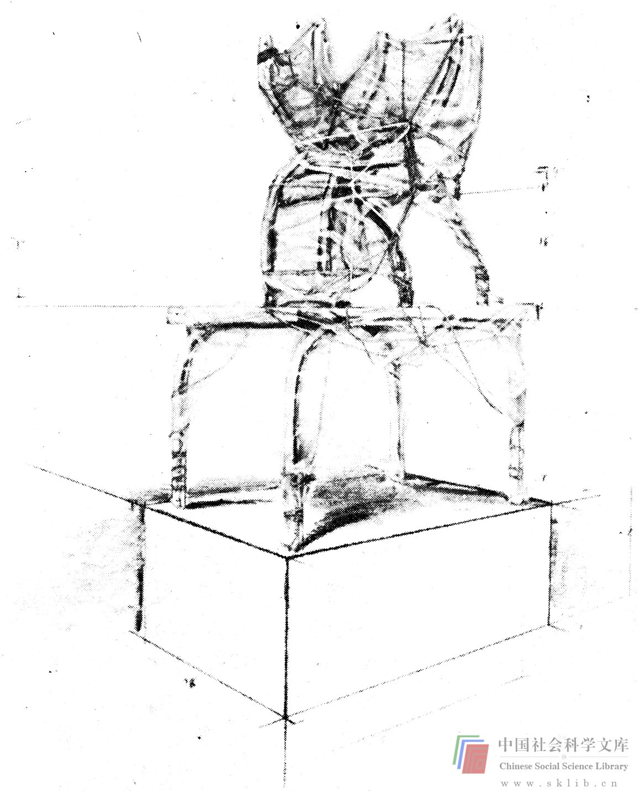

# 表达障碍

在讨论表达障碍时，让我们先来做一个简单的练习。

> 练习：找到（或制作出）一件简单物品，你无法冠之以通常物品的名称。它可以是一块大石头或木头，但缺了一个角，一个平面上还有一道凹沟；也可以是机器上某个部件或其它什么东西，但必须是简单而又不规则的立体形状。不要用铅笔、剪刀、奎宁水瓶这些实用性强，人人都熟悉的物品。找几个人来，把你选中的物品放在一个大纸袋里，要某个人把手伸进纸袋里摸它，但不能看它。此人向其他人描述物品的形状，其他人把它画出来。

这个练习难度之大是惊人的。在人们进行交流时缺乏反馈当然是一个原因。若允许绘画者向描述者提几个问题，可能产生一些反馈，而做这个练习时若不允许提问，则效果更佳。此外，单凭手的触摸来确定物品形状并非易事。但最大的困难恐怕莫过于用言语来描述具体物品了。做练习的人若具备一些数学知识，用XYZ或几何学的叙述技巧进行交流，便可完成得好一些。假如用日常语汇描述，就困难多了。（比如，“底部是长方形，缺了一个角，从缺角向上有一个短平面”）。这个练习难度之大还有另一原因，那就是绝大多数人更缺乏绘画才能。即便你可以用言语把物品描述清楚，大多数人仍无法准确地把它画在纸上。

我常在由许多人参加的一组人中间做这个练习，这样我便可以在练习之后把那些绘画作一番比较。众人同时参加练习还可以增加一些有趣的感情障碍。描述者若花费一定时间好好摸一下物品，他会描述得更准确些。然而，在许多急不可待的人面前，他几乎没有时间这样做，他往往立即着手描述，而且，话又说得很快，（绘画者甚至很难从中攫取有用的信息）因为站在众人面前干这么一件事情——把手伸进纸袋里摸东西——使他感到难堪。另外，他觉得自己已经完全了解物品的形状了（他用手摸到了），他难以相信绘画者仍搞不清楚，他可能会失去耐心。做过练习之后，他肯定会想出更好的办法来完成他的描述任务。

这个练习表明，我们往往使用不适宜的语言技巧来表达思想，而我们的文字表述又不准确。这是在诸如工程专业中极常见的一种障碍。许多学生和工程师不喜欢绘画，他们觉得绘画困难。另外，在某些专业领域中，人们更看重分析能力，不大瞧得起绘画。因此我们看到，有人总喜欢用文字来阐述交流几何学方面的问题，而这种表达障碍所造成的困难局面经常得不到重视，因为描述者确切地知道他所描述的物体，绘画者自然也认为他对描述者的理解完全正确。下面这个问题同样可以显示出由不准确的文字表述所导致的障碍（如果你可以找到十多个人一起做）：

> 练习：给第一个人看一张简单物品的图片（仍为一种比较抽象的物体，无法冠之以通常的名称）。要他看一会儿，然后向第二个人描述此物的形状，第二个人再向第三个人描述，如此轮番做下去。必须注意，一个人向另一个人做描述时，其他人不得听到。每人都做过之后，让最后一个人把物体画出来。将这张图与原始图片作一比较是十分有趣的。

我们不难找到其它一些表达障碍的例子：当你尚未真正掌握一门外语却要用它来表述某些概念，这是很典型的表达障碍；再如，一位习惯于用打字机写作的作家，打字机偏偏坏了，他必须改为手写；又如一位经理，他的速记录音机被送去修理，或者他那位能干的速记员生病了；一位不会使用计算机的人面对当代社会，等等，上述这些人面临的窘境都是表达障碍。在以上情境中，表达的迟钝会给解决问题的人造成困难。

