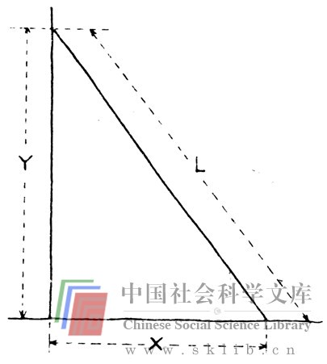

# 第六章 互补思维语言

我们在第五章讨论了由于解决问题的“语言”选择不当而造成的思维障碍。我想在本章细致地讨论这一点。有些人能够发现问题和解决问题，因为他们思路敏捷，精通多种思维语言，并能够自如地交替运用它们储集信息，调动潜意识，并有意识地巧妙地善处问题。这些思维方式中有些对我们来说比较“自然”，有些则不然。把它们结合起来使用比单独使用往往效果更佳。

我在本章将讨论这些思维方式或思维语言，着重说明我认为没有受到足够重视的几种思维语言。在此之前，请作以下练习：

> 假设你刚刚让一个人搭过你的车，这个人恰好是一个怪癖的建筑师，非常富有。为了表示感谢，他主动提出按照你要求的规格为你加盖房子，唯一的条件是全部费用不得超过12000美元。现在请你构想要加盖的房子。做此练习时，请注意你在想些什么（针对要加盖的房子，而不是眼前的情景是否合乎情理）。

你会再次发现，思维摆动于意识和潜意识之间时，很难捕捉思维过程。然而，你是否大致知道你使用了哪些思维“语言”？言语思维、量化思维、形象思维，你采用的是哪一种？你想象出什么味道与声音吗？有什么触觉感觉和肌肉感觉吗？你是否往往仅用一种语言进行思维？

如果你同多数人一样，那么你会很容易地回忆起用言语进行的思维。言语思维是美国文化中最主要的心理语言（大概也是最常用的）。

许多心理学家和普通语义学家都认为，语言文字是思维的基础。例如：L.S.维格斯基（L.S.Vygotsky）在《思想和语言》一书中说：“思想是通过文字产生的。”爱德华·萨皮尔（Edward Sapir）在《语言》一书中说：“语言和思维习惯错综地交织在一起，从某种意义上说，它们就是同一种东西。”我们的教育制度更强化了这种偏见。G·凯普斯（G.Kepes）编辑的《视能教育》一书收有鲁道夫·安海姆（Rudolf Arnheim）一篇题为“视觉思维”的文章，文章说：“读、写、算是我们的学校所培养的技能，这些技能把儿童与感官体验（与语言活动或数学技能相对）分隔开来。只有幼儿园和小学一年级的教育才以综合培养大脑的各种基本智能为基础。在此之后，这种自然而明智的教育方式被取缔，因为它有碍于培养良好的抽象思维能力。美国的文化重视阅读速度与理解，重视主要取决于语言天赋的智商测验和语言天赋的实际运用；语言天赋被视为学术潜力与职业潜力的极端重要的标志。

作为一个语言能力较强的人，我绝不否认那些把文字神圣化的人是无比英明的。无疑，许多问题通过语言可以圆满解决。这种解决方法可以通过现有的语言系统来传达。但是，正如我们在“和尚谜语”和“折纸练习”中看到的，也有一些问题若用语言解决则要费一番周折。考虑下面几个问题时，请记住这一点。

> 问题1：鲍勃的松果比丹的多3倍，他们共有28个松果，两人各有多少？

这个问题可以借助逻辑推理，在几种可能性之间运用试错法，以文字加以解决。计算过程相对来说较为简单。也可以用代数方法进行运算：

> b表示鲍勃的松果数

> d表示丹的松果数

> 我们可列出以下方程：

> （1）b+d＝28

>（2）b＝3d

> 将（2）代入（1），得出4d＝28。所以丹有7个松果，鲍勃有21个松果。

只要懂得代数，多数人都不难解答这类问题。然而，请看下面的问题。

> 问题2：玛丽的松果比诺拉和奥斯卡两人所有的松果多3倍。丹的松果比鲍勃的松果多2倍。玛丽比丹的松果多1倍半。奥斯卡和丹所共有的松果等于诺拉的松果加上2倍的鲍勃的松果。鲍勃、丹、玛丽和奥斯卡共有28个松果，他们各有多少松果？

我提醒一下，如果你不熟悉代数运算，这个问题会比前一个麻烦得多。运用试错法只要功夫尽到，这个问题也是可以通过逻辑的言语思维来解决的。但是，由于问题的实质并不重要，所以如此大动干戈、大算特算很让人头痛。数学方法显然占优势。这个问题可以用代数运算解决如下：

按照上例表示玛丽的松果数，n表示诺拉的，o表示奥斯卡的。这些数量之间的关系可以这样表示（包括丹的松果数d和鲍勃的松果数B）：

>（1）m＝3（n+o）

>（2）d＝2b

>（3）m＝3/2d

>（4）o+d＝n+2b

>（5）b+d+m+n+o＝28

你们当中擅长数学的人一定会发现，这些数据之间的关系为我们提供了足够的方程去求解所有的未知数。一种求解方法（不是唯一的方法）是，首先将方程（1）中n+o的值代入方程（5），（即：n+o＝m/3），可得：

> b+d+4/3m＝28

从方程（2）可以看出b＝d/2，将其代入上式得：

> 3/2d+4/3m＝28

但是方程（3）说明m＝3/2d，将其代入我们的方程可得：

> 7/2d＝28

> d＝8

这样，丹有8个松果。得出了这个数字，我们便能够满意地回到最初的方程式，得知鲍勃有4个松果〔方程（2）〕，玛丽有12个松果〔方程（3）〕，诺拉和奥斯卡共有4个松果〔方程（5）〕。因为方程（4）告诉我们奥斯卡和诺拉有同样多的松果，那么他们各有2个。

所以，有些问题用很简单的数学语言便能解决，而用言语方法解决则很棘手。现在准备考虑第三个问题。

> 问题3：假设诺拉一赌气找来一架梯子，她想顺着梯子爬上树去，采到同玛丽一样多的松果。梯子长10英尺，树干与地面垂直。诺拉正好爬到梯子的最高一阶时，梯子开始滑落。如下图所示，假如梯子的底端距离树干6英尺，以每秒5英尺的速度在地面上滑退，求诺拉跌落的速度。

你怎样用言语求解这个问题呢？大概根本解决不了，因为你无从入手，试错法很难奏效。我们再次发现，只要略知三角学并具有基本运算能力，这个问题用数学方法便很容易求解。如果将问题抽象化，可用下页图表示。树的根部和梯子底端之间的距离为Ｘ，地面和梯子顶端的距离是Ｙ，你可以采用毕达哥拉斯定理，将这两个量与梯子长度之间的关系表示为：

> X^2+Y^2＝L^2

X是6英尺，L是10英尺，代入公式得知，Y是8英尺。如果从时间角度求以上算式的微分（一种基本运算程式），我们得知：

其中上面加点的量表示速度。X为6英尺，Y为8英尺，为每秒5英尺，代人公式得出，我们所求的量）是每秒英尺。这又是一例用数学语言简便易行，用文字言语则不易解决的问题。

显然，如果你想预知物体在空间的运动方式，如某些复杂的机器与建筑物的组成部分，或者是人口和资源，你必须把数学思维纳入你的思维方式。如果你按照食谱烹调，到银行存款结帐，或者使用草坪肥料说明书，你也必须运用数学。假如你不把数学作为一种思维方式，遇到涉及数量的问题时你将一筹莫展。

虽然数学天赋与运算能力在美国社会的某些领域备受尊重，然而语言才能与表达能力更普遍地得到推崇。甚至数学盲在某些领域似乎还是不可多得的长处。有些人仿佛感到摒弃数学是一种文化上的需要，大肆炫耀自己在数量问题方面的无能为力，对数学避之不及，好象数学是一种机械而且没有灵魂的东西。这当然是一种错误观念，因为真正的数学家是受高度发展的美学意识所驱使和引导的。尽管如此，数学家们在美国的就业范围往往很狭窄，多数高薪职位中，精通数学远不如能言善辩占优势。例如，如果我参加美国总统竞选（假设这是个高薪职位），我大概不会在全国电视上向对手挑战比试数学解题。事实上，如果我还想做出什么努力的话，那我大概还会掩藏自己的数学能力，以不致失去所有那些在孩提时代就厌弃数学的人们的选票。

如果有更多的人运用数学解决问题（即使低水平地），就有希望全面提高解决问题的质量。综合使用数学思维和言语思维比单一地使用言语思维能够更有效地解决问题。我不想对数学思维的意义作进一步的探讨，因为这已是公认的事实。我之所以讨论言语思维和数学思维是为了说明学会运用两种思维“语言”能使人更有效、更老练地解决问题，说明有些思维语言较其他思维语言更受推崇（人们更多地赖之以解决问题）。

现在我想讨论我们设计部的人认为在思维过程中极端重要、甚至比数学更鲜为使用的几种思维语言，即感觉语言，包括视觉、听觉、味觉、嗅觉和触觉。