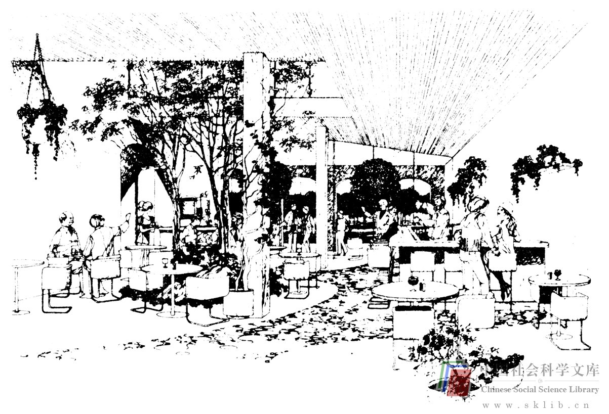
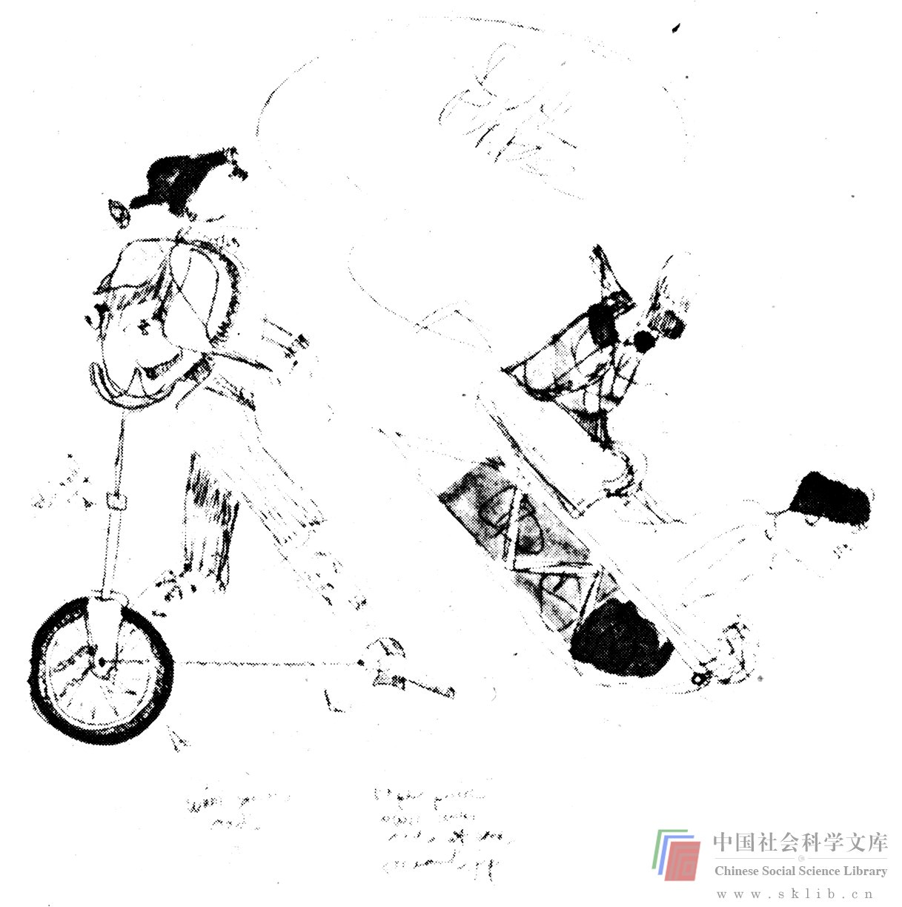

# 视觉思维

我已在前面几次提到，视觉思维是一种尤为重要的思维方法，这种思维方法在学术界越来越引起重视。鲍勃·麦金（Bob Mckim）的《视觉思维实践》和鲁道夫·安海姆的《视觉思维》全面阐述了这个课题。视觉思维是一种重要的思维方式，对于求解有关轮廓形状和图形的问题有特殊用途。安海姆解释说：“人人都经常使用视觉思维。它在棋盘上指导棋局，在地球上谋划全球的政治。两个动作敏捷的人在环形楼梯上挪动一架钢琴，他们使用视觉思维，错综交替地提起、移动、转弯……”我们在某些情况下都使用视觉意象。例如：视觉意象在梦中出现得极为频繁。有人向我们问起某人的相貌特征或某地的风光时，我们也经常使用视觉意象。但是有时出乎你的意料，思维也使用视觉意象。

《创造行为》一书引用了费里德里克·凯克尔（Friedrich Kekule）的一段话。凯克尔是一位著名的化学家，他潜心研究苯的分子结构，冥思苦想，难解其谜，后来偶然在梦中发志了苯环的奥秘。他这样说道：“我转过椅子，面对壁炉，打起了瞌睡。众多的原子又开始在我眼前跳跃飞舞。这次那些稍小的原子羞怯地躲在后面。我的想象已被这种屡次出现的幻觉引逗得非常敏锐，所以现在能辨出多种形态的稍大的结构：众多的原子排成长长的队列，有时更紧密地聚在一起，都象蛇一样地缠绕着、蠕动着。看，那是什么？其中一条蛇咬住了自己的尾稍，那个环状物在我的眼前嘲弄似地旋转着。我象是挨了雷电一击似的突然醒过来。”这个梦的结果便是凯克尔的卓见，即有机化合物的分子结构是封闭的环形而不是开放型的，苯便是一例。

鲍勃·麦金在《视觉思维实践》中提出了有效视觉思维所必需的三种视觉意象。第一种，视感意象，即对客观世界的视觉感知，是人之所见并储之于大脑的印象与信息。第二种，理性意象，它在大脑中形成，消化使用视感意象所积累的印象与信息。第三种，图式意象，这种意象是采用草描、乱画、勾勒或其他书面形式记载下来的，它可以辅助你的思维过程或与他人进行交流。

首先简要地论述视感意象，或者叫做视能。在第二章中曾让你画过一个电话拨号盘，希望你已经相信你的大脑并不能储存你所看见的一切事物，至少没有达到事后能够记起的水平（在催眠状态下，你也许能借助某种力量把拨号盘画好）。出于种种原因，人的视能很差。如前面所提到的，原因之一是信息输入的超饱和，另一原因是缺乏动机。有些事物对人们更重要、更不寻常，或者有便于记忆的视觉特点，对这些事物人们往往看得更清楚。

你可以有意识地提高视能，尤其是如果你已经确信提高视能对你至关重要。迅速提高视能的一种方法是进行那些在观看之后必须复述事物的活动。

> 练习：你要锻炼视能，可以先观看事物，然后把它们画出来。这样的活动不仅需要看，而且需要想象与绘图，这在以后还会谈到。现在用你周围的东西试试，或者更进一步，用那些职业范围内的你自认为深入了解而有益的东西。

上绘画课可以改善你的视能。如果你需要画树，你就要开始真正地看树。我曾选修过美术课，老师非常乐于让我们速描朋友、家人、宠物、住所及邻近地带。我觉得特别有趣，因为我观看周围环境的仔细程度至少比平时大两个数量级。我的一个同事选修过摄影课，老师带上一坛豆子，领着学生去乡间田野，为班里的每个人各往地下扔一颗豆，然后让每个学生站在自己的豆子处，拍上一整天的风景照片。这种活动迫使人真正睁开眼睛看世界。拍摄美国科罗拉多河流域的大峡谷或其他什么奇观妙景的照片，你不用费多少力气仔细观看。然而，站在田里，脚下踩着一粒豆子，想拍一张美丽的照片就要充分发挥你的视觉能力了。

现在来谈第二种视觉意象，理性意象。人在考虑问题时这些反映在大脑中的意象或许是最为重要的。根据麦金的看法，视觉意象有两个重要方面。他把第一个方面叫做清晰度（图象轮廓的鲜明程度和各个部位的清晰度），把第二个方面叫做控制度（你可以在多大程度上把握这些图象）。这里有一个练习可以判断你的视觉“成象”能力。

> 练习：测试理性意象的清晰度。想象下列事物。根据脑际出现的各个图象的清晰度（轮廓清楚，各个部位清晰可见），在每项后面标出清楚（C），模糊（V）或一无所知（n）。

> 1. 一个朋友的面孔

> 2. 你的厨房

> 3. 你的汽车前部的铁格

> 4. 山茶花

> 5. 招潮蟹

> 6. 波音747

> 7. 奔牛

> 8. 地球运行出轨

> 9. 你的第一辆汽车

> 10. 理查·尼克松

你的大脑构成的图象的清晰度取决于几种因素。首先是见识。如果你从未见过招潮蟹或奔牛，你头脑中大概不会有太清晰的图象。其次取决于你的视能。如前面所谈到的，视能又取决于动机（假如你迷恋山茶花，那么你的山茶花图象会更清晰），而且还取决于事物的视觉特征（理查·尼克松的图象可能颇为清晰，因为他常在新闻影片和政治漫话中出现），以及时间的长短（你对你的第一辆汽车可能已经记忆模糊）和信息的饱和程度（注意到你汽车上的铁格子了吗？）等等。最后，图象的清晰度取决于你的大脑再现图象的机制是否健全。当然，视觉想象力因人而异，其变幻形式远远多于以上所提到的。如果你让一屋子的人构想一块砖头或一只苹果的视觉形象，你将得到各种不同的描述，其清晰度体现在很多方面，如颜色、细节、质地、背景、影象，或者根本没有具体形象。

> 练习：将一系列物品视觉化，看你是否可以判定自己的视能特点，这仅供你个人参考。人与物相比，你是否更善于将人视觉化？二维物体与三维物体相比，你是否更善于将二维物体视觉化？小物体与大物体相比，你是否更善于将小物体视觉化？你看到的图象在哪里？是在眼前还是在脑后某处？

视觉成象能力很复杂，因为它不但取决于你的成象能力的强弱，还取决于你大脑中贮藏的永久性意象的多寡。然而，似乎可以说，通过主观努力，并在解决问题时首先考虑使用视觉思维，你就可以提高视觉成象能力。视觉意象还可以通过自觉的活动得到改善。我在斯坦福大学作约翰·阿诺德（John Arnold）的学生时，他时常要求我做“将一只苹果视觉化”之类的练习，使我屡遭惨败。因此，我变得十分条件反射，每每让我把什么东西视觉化时，我仍然调动我所掌握的一切信息，全神贯注于所面临的问题。现在我们来看看你对视觉意象的控制能力。

> 练习：想象下列事物或现象：

> 1 .一壶水已经滚沸，溢了出来。

> 2 .你乘坐的波音747正在被牵离停机地点，滑向跑道，等待另外几架客机一同起飞。

> 3 .你的奔牛渐渐变成了一匹飞驰的赛马。

> 4 .你所熟悉的一位老人返老还童。

> 5 .一辆快速行驶的汽车撞上了一个巨大的羽毛枕头。

> 6 .作与练习5相反的想象。

你更善于控制实际见过的图象，还是更善于构成新的图象？你能离奇地变幻意象吗？花些时间，看你能否对自己控制视觉意象的能力加深认识。练习控制不同类型的图象，在头脑中发明新的图象，等等。许多人认为控制视觉图象的能力可以通过练习得到提高。鲍勃·麦金在《视觉思维实践》一书中将他所谓的“有向奇想”作为一种增强想象力的方法进行了探讨。参加“有向奇想”活动的人应该向着不同的方向极力发挥幻想能力，以进入更大范围的想象活动。他被迫“锻炼”自己的想象力，并且正视通常避而不见的想象障碍。他一旦发现自己能够在这些范围内驰骋想象而不招来什么可怕后果，就会鼓起勇气进一步熟悉视觉意象在思维过程中的作用。

现在来谈第三种视觉意象——图式意象。为了充分利用视觉思维能力，绘图是必不可少的。绘图可能通过记载、贮存、操纵和传达图象扩展你的想象中所产生的图象。在设计部中，我们认为不妨把绘画分为两类：传达给他人的图画和为自我思考所做的图画。下面这类图便是一般用于传达给他人的，制图者是旧金山市的建筑师沃尔特·托马森（Walter Thomason）。而另一幅图则是随便涂抹的，这类图一般供自己思考时使用，绘图者是斯坦福大学工程学专业的研究生彼特·德莱西加克（Peter Dreissigacker）。（你画的图不必这样具有艺术性）

第一类图（传达性的）在教育方面备受重视，你可以通过专修课程学习绘制这样的图画。第二类图（思考性的）却往往被忽略，然而它对视觉思维是一种重要的补充。多数人在求解例题时，只要有纸和笔在手边都会绘图。奇怪的是，同样是这些人，在解决实际问题的时候却懒于主动拿起绘图用具。

我可能对这些具体问题过于敏感，因为我有很长一段时间在大学讲授图案设计课，吸引了一大批语言能力较强的学生。正统教育不遗余力地培养他们的语言（和数学）能力，却很少顾及他们的视能。他们刚刚考入斯坦福大学时，很多人都是“视盲”。他们往往不习惯于绘图，也不习惯于把视觉意象作为一种思维方式加以运用。虽然他们的绘画能力普遍较差，但是，一般也足以（尤其在有些提示的条件下）用作辅助思维的一种手段。然而，他们往往不情愿提笔绘画，因为他们的绘画水平与职业画家的（以传达给他人为目的）相距太远。在设计课上，我们积极鼓励学生为了自己的思考而绘制粗糙但却内涵丰富的草图。既然我们认为高超的绘画技能是思维的有力辅佐，我们也敦促人们提高这种技能。试做以下练习，看看你的绘图能力（无论多么不在行）是否有助于你的思维。

> 练习：买一个大小适宜的廉价笔记本（小至可以随身携带，但是从其他方面考虑又要尽可能大些），找上一支理想的绘图笔（品特尔型铅笔不错，样子象原珠笔，纤维笔尖尖细，书写流利，颜色暗黑，笔划清晰）。用一个星期左右，当你考虑或求解问题时就在这个本子上画图。你所画的图可能是草描、方格图表、简图、随写、速描或者其他什么形式。看看这些图哪些有助于求解问题（如果有的话），哪些效用不大。它们是否对解决问题过程中的某些特定阶段（例如着手解决问题时）更有效？绘图水平低是否有碍图的效果？你回忆前几天绘过的图时是否要查阅本子？本子的大小是否不合适？（如果是这样，就换上白报纸或壁纸，粗芯笔或彩笔，接着画下去）。

我把绘图作为一种思维技巧加以强调，并不是轻视其交流作用。我见过很多人，他们的绘图能力很强，同时在解决问题时能够影响他人，无论结果好坏。这在没有先例的设计工作中尤为常见。最近我指导一组学生设计一种新的水上交通工具，有一个学生非常擅长快速制图，常常是，他提出一种非常切实可行的构想，同学们便欣然采纳。然后，当他第二天又产生了另一构想时，同学们都惊疑不已，最后又采纳了新的构想。设计宇宙飞船也没有什么可供参考的先例，在这方面我也目睹过同样的事情发生。一幅优秀的设计构想图有着惊人的威力。当然，既便是非常粗糙的图也有惊人的传递确切信息的功能。例如：我有个莫逆之交，是个农场主。我去拜访他的时候常常陪他一起去巡视农场的情况。我乐于助人，尽力帮助他干各种各样的活计，通常是挪动庞大而笨重的东西。这种活动对我这样的人来说易如反掌，我毕竟是个工程学教授啊。然而，他口头传达的各种指令，使我不知所措，恰如我们在第三章描述袋中之物的练习中所遇到的情况一样。我从长计议，打算教他用画图的方法指示我和他的雇工，这样我们就不至于把东西放错了地方，显得那么笨拙。

> 练习：给人指示时尽量发挥你的绘图能力，无论多么不在行。如果有必要，带上小纸簿和铅笔。你可能很会画指路图，告诉人们怎样找到你的家。但你是否曾为孩子们画张图，告诉他们把耙起的树叶堆在哪里，给丈夫画张图，告诉他把家里的东西收拾好，给妻子画张图，告诉她怎样切烤肉（请原谅角色划分）。

关于视觉意象这一极为重要的思维工具，我们暂且谈到此。如果你有时间，并且愿意培养你的视觉思维能力，《读者指南》这本书将帮助你起步。你至少应该了解自己在视觉意象方面的能力与局限，尽量不放过任何适当的机会把视觉用于思维过程。这在所有的思维方式中是最基本的一种，也是解决问题时难能可贵的一种。

