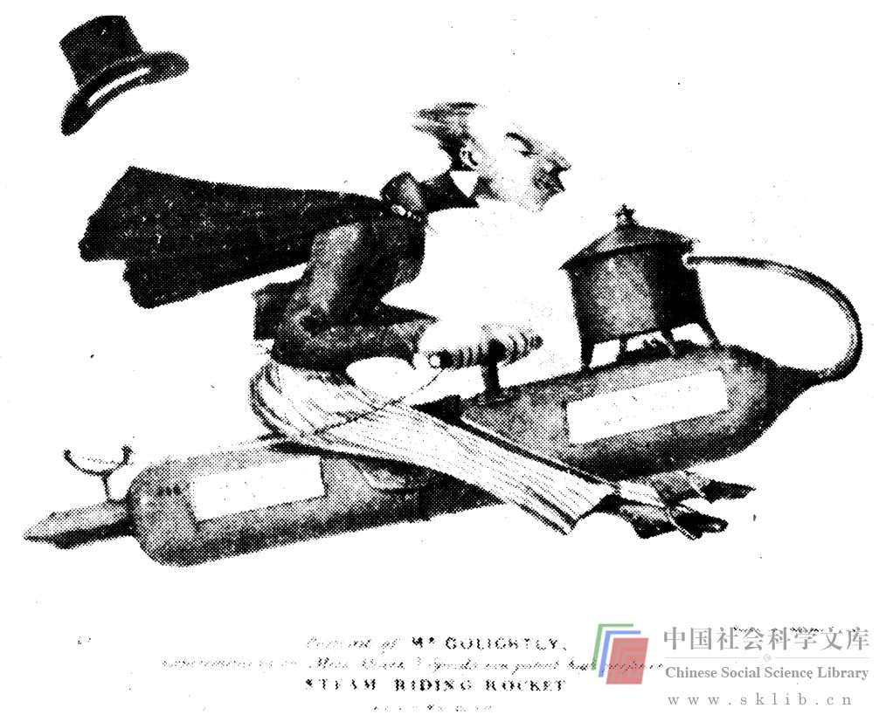
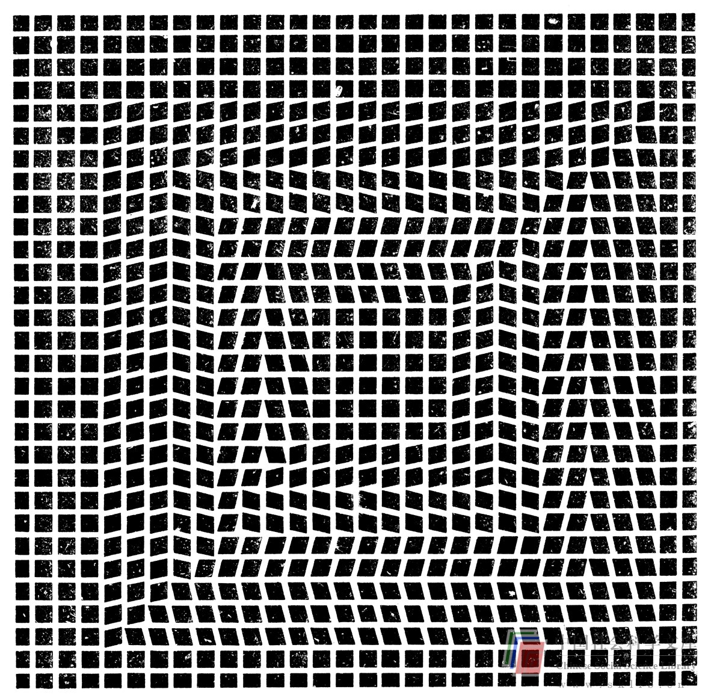

# 其他感觉语言

现在我们来谈几种思维所必需的、在解决一般问题时较视觉思维更少被人们所采用的其他感觉语言。正如视觉意象与视觉有关，其他感觉意象也各自产生于相应的感觉器官。

请做以下各项练习，检验你对不同感觉意象的敏锐程度。仍分为清晰（C），模糊（V）和一无所知（n）。

> 练习：试想下列事物与现象：

> 一位朋友的笑声

> 雷声

> 一匹马行于路上的声音

> 一辆赛车的声音

> 湿草的感觉

> 你妻子的/丈夫的/女朋友的/男朋友的/头发或宠物的毛皮的手感

> 跳入冰冷的游泳池的感觉

> 流鼻涕的感觉

> 正烤着的面包气味

> 鱼的气味

> 汽油的气味

> 树叶燃烧的气味

> 菠萝的味道

> 塔巴斯哥辣酱油的味道

> 牙膏的味道

> 爬绳子的肌肉感觉

> 抛石头的肌肉感觉

> 跑步的肌肉感觉

> 蹲着的肌肉感觉

> 冷得难受的感觉、

> 进食过量的感觉

> 极度幸福的感觉

> 长时间打嗝的感觉

***

> 现在请做以下练习，测试你对各种感觉意象的控制能力：

> 由冷得难受变为热得难受的感觉

> 一个朋友的笑声变为雷声

> 湿草的感觉变为你妻子的/丈夫的/女朋友的/男朋友的/头发或宠物的毛皮的手感

> 鱼的气味变为汽油的气味

> 爬绳子的肌肉感觉变为划船的肌肉感觉

***

这些练习的作用相当于前面的视觉意象练习，如果大量进行类似的练习，你的感觉意象能力就能得到提高。无论如何，这些练习至少能使你更了解自己运用各种感觉语言成象的能力。

从生理学的角度看，视觉往往是占首要地位的感觉。然而，正如不能让言语思维把视觉思维排挤掉一样，也不能让视觉思维赫然压倒其他感觉思维。嗅觉、声觉、味觉和触觉对于解决问题也极其重要，理由有三：

1. 由于这几种感觉在美国文化的思维方式“威望”表上地位低微，它们可以使你在解决问题时找到创新的、被人忽略的方式（美国作家艾德加·雷斯·柏洛兹的历险故事中的主角塔赞的嗅觉非常灵敏，但是我敢肯定，没人指望一个诺贝尔奖获得者也能是这样）。

2. 解决问题涉及嗅觉、听觉、味觉和触觉时，这几种感觉语言是必不可少的（如设计一种新的冷盘菜）。

3. 这几种感觉加强视觉意象，也互相强化，因此可以提高总体意象的清晰度（后面再谈）。

首先简略谈一谈上述第一种原因。我时常要求我的学生们设计一些方便盲人的器械，一方面因为这种工作驱动力强，需要竭诚努力，同时也可以促使他们考虑各种感觉输入。他们多数人着手解决问题时想象自己是盲人。这做起来很难，因为多数人的信息绝大部分是通过视觉输入的，以致他们感到仅仅靠想象很难扮成盲人。如果他们一般只使用言语思维或数学思维，这就尤其困难。

让学生把问题考虑片刻之后，我把他们的眼睛蒙上一两个小时，让他们在外面信步行走。这立刻使他们有机会通过其他感官输入信息，他们就更有可能运用这种重要资料（对于一个盲人来说）去解决问题。假扮盲人时感觉的准确度有限，因为一般人的眼睛被蒙上一两个小时，他们的主要困难在于行走，而真正的盲人早已克服了这个困难。但是，假扮盲人有助于人们通过其他感觉器官来接收信息。

> 练习：你自己这样试试。找个人关照你别出事（不是领着你，只是别让你走上快车道，别掉进阴沟检修孔，别碰在毒漆树上等等），把眼睛蒙上，随便走上大约一个小时，你将为收集到的感觉资料之丰富而感到惊愕。

应该利用所有感官的第二个原因是，“它们是解决涉及嗅觉、听觉、味觉和触觉的问题所必需的”，这应该是显而易见的。正如建筑师有卓越的能力构想空间与形式，厨师有卓越的能力臆想味道和气味。

第三种原因更微妙些，“它们加强着视觉意象，也互相强化”。你们多数人一定知道，各种感觉都是互相强化的。食品是味道、气味和色形的结合。感冒时喝维希奶油浓汤就象吃染成蓝色的摊鸡蛋一样大煞风景。一场惊心动魄的风暴只有声象俱全才能真正产生强烈的效果。促进性兴奋的因素不但有视觉和听觉，而且还有触觉、嗅觉和味觉。同样，要想有生动的理性意象，就要最大限度地调动利用所有的感觉器官。

为了说明这一点，我想让你做另一个练习。但是，开始之前，先想象一只苹果。想出来了吗？就这只苹果向你自己提问题，直到有了清晰的图象。

我现在给你提供一盘磁带的文字，这是鲍勃·麦金和比尔·维普兰克（Bill Verplank）在斯坦福大学的视觉思维课上使用的磁带。磁带的内容涉及综合感觉意象的清晰度与控制度。他们在幽静舒适的环境中把磁带放给小组学生们听。学生们总是分散开来随意坐在柔软的地毯上，周围没有任何干扰。他们事先听过关于此项练习的讲座，连续几周上课强调感觉意象的重要性，为听录音做好了准备。

> 练习：

> 1. 找一个愿意合作的讲解员，最好再找其他几个对这一课题感兴趣的人。

> 2. 为讲解员找几只形状、颜色好看的苹果，再让他给每人发一只。

> 3. 找个舒适的地方与其他人一齐放松

> 4. 请讲解员为你朗读下面的文字。他应该念得徐缓、郑重、平和，继续念下文之前给你留出足够的时间构想图象，图象完全构成时，你可以打一个预先商定好的手示（抬起一个手指？）这时讲解员就继续念下去。

“首先闭目放松，排除杂念。现在假想你自己处在一个熟悉的环境中，津津有味地品味着苹果，使自己轻松地融入这个地方的感觉氛围中。现在，想象你手里拿着一只鲜美可口的苹果，感受苹果的清凉、重量、坚硬、圆润和光滑，抚弄苹果的枝茎，用视觉想象对苹果细细体察，看上面的瘢痕，阳光照在苹果表面闪闪发亮，果皮呈现出纹理和斑点，呈现出多种颜色，而非一种颜色。在想象中跟随着这个意象，直至感到口水涌出。现在咬一口苹果。倾听咬苹果时饱含汁液的声音，品味其质地、口感和芳香。用水果刀把苹果切开，看看里面是什么。一边继续细察苹果的特点，一边不时地环顾四周，看看自己的手，感受微风轻拂，心中想着三维的形体和空间。

“这次你的苹果怎么样？也许比平时好吃多了。但你的苹果可能仍不那么真切，只因为你并不真正知道苹果是怎么回事。我们都吃过很多苹果，然而又何曾真正留心过呢。我们在吃东西、说话、读书、写字、思考问题时，常常还做着其他事情，而从未注意到各种感觉的特点。现在给你们每人一只苹果（分发苹果），可以吃。要求大家不说话，把注意力都集中在苹果和自己的感觉上。吃之前先观看苹果片刻，注意其形状、大小、颜色和上面的斑纹，感觉其温度、质感、硬度和质地。当你真正了解了这一切之后，咬一口苹果，倾听声音、品尝味道，细细体味，不放过任何感觉特点。慢慢来。

“你刚吃掉的苹果正在被你的消化系统吸收。苹果正在和你融为一体。假设你就是那只你刚刚吃掉的苹果。假设你是苹果树上的一只苹果。深呼吸，然后呼出，边呼气边放松，排除所有杂念，轻松地将注意力转移到这样的乐事中来：你是远处乡间美丽的苹果园中一棵真苹果树上的一只苹果。你会感觉到你周身沐浴着温暖的阳光，微风轻拂。天空晴朗湛蓝，阳光射入你的体内，感觉很舒畅。你能听见树枝上的绿叶迎风沙沙作响，园中正成熟的苹果芳香扑鼻。作为自然的一部分你感到很惬意。现在假想你的时间倒退。你是一只倒退到过去时光中的苹果，越变越小，越变越绿，越变越酸，越变越小，最后你成为一朵苹果花。你是苹果树上那么多苹果花中的一朵。你闻得到苹果花浓郁的香气。温暖的阳光照耀着你稚嫩的花瓣，你尽情地享受着这一切。你听得见蜜蜂嗡嗡飞舞，给果树传粉，农夫的狗在远处汪汪吠叫。你尝得到自己的甜美汁液。你感到自己是异常复杂的自然变化过程中的一个内在组成部分，包括太阳、大地、空气、蜜蜂、四季等等，这多么快意。这时你渐渐明白，你不仅是一朵苹果花，而且还是一棵苹果树。让你的想象游入那小花俏立着的枝头。你可以感到树液使枝叶和花朵充满活力，可以感到树液在你的体内流淌。请你随着这股活力进而潜入苹果树的躯干。在你体内感觉树干的力量。你要支撑满载成熟果实的枝杈，抵抗狂风的侵袭，就得粗壮有力。感觉你的树皮纹路粗糙，木质坚硬。现在把思想由树干引向你的苹果树的根系，深入黑湿的土地。注视着土地的黑暗，闻闻沃土的醇香，看看刨土的小肥虫和地下其他的小生命。随着你的根系伸入养育生命的水和肥份，感觉湿土和石头那清凉的湿润与质地。现在让你的精神离开树，使自己变为潮湿的苹果林地里的水份。感觉你在滋润着闲花野草。你是一个更大的概念的一部分。你是生命所必不可少的东西。你是大自然浑然之整体的一分子。随着苹果林地下水的涨满，感受太阳的热力吸引你冉冉蒸发，感受阳光使你的身体汽化，你由液体变成水汽。感受你的分子蒸腾升起，飞向蓝天，飞向火热的太阳。此时你和其他人变成朵朵轻云，你可以俯瞰大地和那片小小的果林，你自在地漂荡在蓝天中。无声无息，波涛般地翻滚，自由得让人难以置信。远处有一只雄鹰在翱翔。你是自然之新陈代谢周期的一部分。现在天色渐暗，愈加凉爽，你会感到风盘旋着吹过你的浮云。你与其他水分子凝成雨滴，穿过阴冷的天空飘然下落，下落，再下落。你溅湿了绿色的苹果叶，跌落在地上，渗入土壤、根系和粗壮的树干，融进滋养着枝叶花果的树液。你是雨天果林树上的那只苹果。你能听到雨水拍打在树叶上，感到阴冷的暴风摇撼着树枝，闻到湿土的浓香。你的苹果是造化之神力凝成的果实，它在你的腹中正与你化为一体，而你正是这充满生命力的统一体的一个独特部分。当你还原为活生生的自我时，你会感到作为永远充满内在创造力的统一体的一部分是何等的快意。”

班里的学生们经过不少构图思维、视觉思维和各种成象练习之后，才开始使用这盘磁带。然而，我们发现多数没有这种经验的人们在听第一部分时，也想构想出一只香甜可口的苹果的意象，也能更加充分地享受他们的真苹果。我们发现磁带的“控制”部分一般人听起来困难些，不象学生们那样心领神会。但是，这是检验你的意象控制能力的又一标志。现在你可以从冰箱里取出一只真苹果（假如你还没有这样做的话），边吃边去读下一部分——解放潜意识。

