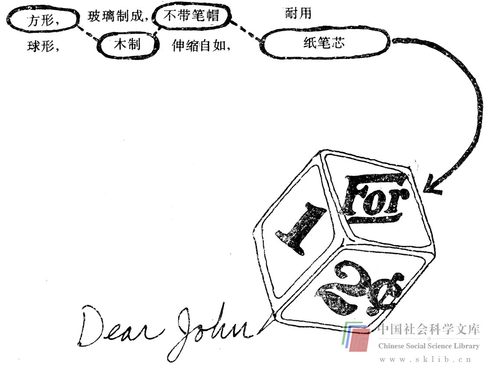
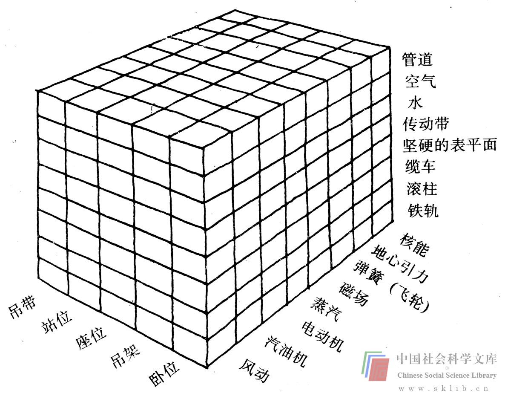
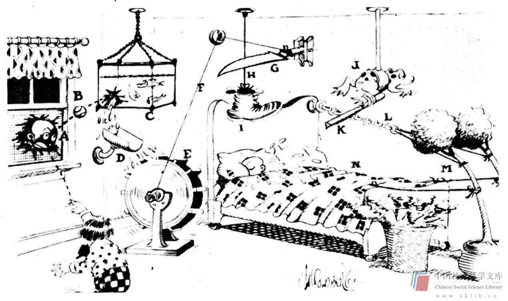

# 思维辅助

《环球旅行者》中谈到了一种巧妙地利用特性列举的方法，作者科勃格和巴格纳尔把这种方法称为“形态强迫联系”。他们的“极为简单的发明方案”有下列准则，并有例子说明其施行方案的方法。请看下面：

例：

> 项目：改进圆珠笔。

圆珠笔的原有特点：

> 圆柱形，塑料制成，分开的笔帽，钢制的笔芯，等等。

> 创新选择范围：棱形，金属制成，连接的笔帽，不带笔芯

> 

> 雕花形，纸制，用于涂改的笔帽，墨水笔芯

> 发明：立体笔；一只角写字，六个平面可用来做广告，夹日历卡，夹照片，等等。

**形态强迫联系**

1. 列举具体物品的特性。

2. 在每一种特性下面写上你所能想到的其他选择特性。

3. 列完之后，从每一栏特性中各选出一种，随意划线将它们连接起来，这些特性集中于一体；形成与最初物品全然不同的一种新形体。

发明创新无非就是旧衣新裁。

另外还有一种归功于弗里茨·兹维基（Fritz Zwicky）的特性列举法，叫做形态分解。这是一种重新组合参项的机械方法，可供人们解决问题时参考。例如，约翰·阿诺德有所尝试，其例引自帕恩斯（Parnes）和哈丁（Harding）所著的《创新思维的渊源》一书，有待解决的问题是发明一种新的客运方法。首先选择了三个重要参项（可供选择的不仅三种，但是很难把它们统统画在一张纸上纳入此书）。三种所选参项的可能性选择范围（动力，载客方式，交通工具的运转媒介）列在下面的三条直角轴线上。

如果我们看图案上的每一格，就会发现每一格都代表了三个参项的一个具体组成部分。例如，一个格代表以蒸汽为动力的设备，在铁轨上行驶，乘客坐在座位上。这没有什么新意，因为这仅仅是一列火车，是步人后尘。乘客在电缆上滑动（滑雪运送机）的电动设备和乘客有座位、行驶于坚硬的路面上的内燃机设备也都同样没有新意。然而，风动设备如何呢？采用这种交通方式时，乘客躺倒，通过管道运送。以地心引力为动力呢？这种交通工具是让人站在传动带上传送下去。如果手边有计算机，能够考虑很多参项，用这种方法能够找出很多组合方式，供解决问题的人从中筛选，最终豁然开朗，问题迎刃而解，而不会遇到很多麻烦。创新精神十足的“语言纯正癖者”往往会嘲笑这种方法太机械。然而，形态分解法确实能产生思维信息。

请看列单子辅助思维（而不是帮助记忆）的另一个例子。我将要求你列一个“改进项目单”。具有健康幻想的人们经常梦想着发明社会需要的某种东西，然后坐享其利。然而，实现这种幻想的人为数不多。难以如愿的原因有两个。第一个原因是很难找出社会的具体需要，第二个原因是发明创新需要经过多年的思考，饱尝经济困难和生活动荡之苦，而后才能指望发明带来报偿。第二个原因对于这种愿望是更大的障碍。但是，由于不排除第一个障碍，第二个也无从说起，又由于我们在此无法解决第二个方面的问题，所以还是继续谈第一个原因。

为了找到成功的可能性较大的发明项目，就必须明确社会的某种需求。确定或找出这样一种需求的方法之一是寻访。例如，你可以去附近的一家医院，向医务人员了解他们的需求所在。另一种方法是从某一个消费领域考虑。假设你是一位卡车司机，那你能否想出什么你所需要的东西。大概更简便的是第三种方法，即自己作为消费者，你一定需要一些其他人也需要的东西，你不妨弄清这些需求，发明某些东西让大家共同受益。

多数人需要妥善处理的一个问题是目标过大，不够具体。如果你的目标是消除空气污染或消除暴力行为，那么你是在给自己出难题，而你要让门前的草坪上不再出现狗粪，那就可行得多了。开始发明创造最好的办法莫过于把具体的发明项目列在纸上，改进项目单就是这样一种东西。你应该列出使你烦恼的东西，尽可能做到思维敏捷，思路灵活，清楚具体，独具个性。

> 练习：准备好纸和笔，列这样一个单子。注意情绪。如果不满10分钟就列完了，那你要么遇到了思维障碍或感情障碍，要么生活受到了过严的控制。假如你想不出任何需要改进的东西，那么我想见见你。

下面是斯坦福大学学生列出的改进项目。你的发明单列好之后看看是否也是如此灵活、具体、独具个性。（你可以在方便的时候对所列出的学生生活中的一些项目大胆地提出解决方法）

如果做得好，你列的改进项目单会给你以发明创新的灵感。列单时一定要说明需要改进的具体方面，保证思维有足够的敏捷性和灵活性。改进项目既要有远离常规的东西，又要有司空见惯的东西。对你们中间的许多人来说，这也许是对生活中烦人的琐事的最认真的思考。

学生列出此单之后，我们常常让他们把设想变为真正的发明创新，每次都会出现一项有趣的“发明创造”，几乎没有例外。这首先需要把列出的项目缩减在几个成功的可能性较大的范围内。（不妨对如何解决问题进行初步的思考。如果有新颖巧妙的解决方法，改进项目的成功的可能性就大些）下一步我们让他们对选定的每一项目各设计几种解决方案，然后让他们选出其中的一种付诸实践（具体细节包括实施计划，适当的时候还包括图形设计）。你愿意的话可以试试。如果成功了赚了大钱，给我寄上一笔，我用来搞慈善事业（付我的房租）。

**改进项目单**

> 盒装便餐

> 买汽车

> 亲戚

> 无纸厕所

> 男性时装

> 烂桔子

> 床上卷发器

> 皮下注射针头

> 甘薯

> 清擦烤箱

> 家庭浴室里没有便池

> 汽车保险杆上摘不掉的招贴

> 磨断了的鞋带

> 不起作用的身份证

> 挂不正的图画

> 不清澈的冰块

> 电光纸

> 向外摆动的车库门

> 滴水的龙头

> 阴雨天潮胀而开关困难的门

> 容易蹭掉的油墨

> 随意乱放的自行车

> 糟糕的书籍

> 秃铅笔

> 烧坏的灯泡

> 连裤袜

> 热力学

> 肮脏的玻璃鱼池

> 吵人的闹钟

> 塑料花

> 快餐早点

> 要缝上的扣子

> 手指上的倒刺

> 汪汪叫的小狗

> 空罐头筒的浪费

> 软冰淇淋

> 弯曲的球竿

> 电视中的大奖赛

> 挖得过宽过深的水管沟

> 浴盆

> 香烟

> 需要打气的球摘去近视镜，换上太阳镜

> 开车时看路线图

> 摇晃的桌椅

> 大串的钥匙

> 不耐磨的鞋跟

> 挡住视线的野营帐篷

> 容易断在酒瓶里的瓶塞

> 不易拿出肥皂的肥皂盒

> 不找回零钱的自动售货机

> 电剃刀的嗡嗡声

> 按钮水龙头

> 单只袜子

> 不好贴的邮票

> 不能在地板上滑行的椅子

> 从衣袋里掏零钱

> 繁杂拖拉的公事程序

> 难闻的废气

> 昂贵的学费

> 写信

> 露天剥采

> 钝刀

> 把耕地变为居民区

> 游泳池里的氯气

> 擦皮鞋

> 折断的辐条

> 绒毛磨光的线

> 凉茶

> 禁止儿童观看他们本来可以观看的电影

> 胸罩

> 刈草坪

> 在图书馆找书

> 卷毛小狗

> 父母决定子女的前程

> 律师挨门逐户打电话

> 卡住不动的打字机键

> 不起作用的减震器

> 剃须

另外一种单子是“检查单”，它可以用来检查思考过程，以确证你没有陷入思维障碍的圈套。斯坦福大学设计部的创始者、设计教育的先驱之一约翰·阿诺德引用了亚历克斯·奥斯伯恩（Alex Osborn）在《应用想象》一书中首先推出的检查单，转载如下。

**新发明检查单**

> 是否有其他用途

> 保持原样另有新用吗？经过修改有其他用途吗？

> 有类似这样的其他东西吗？这件东西能启发你产生其他想法吗？过去曾有过雷同吗？我能够摹临什么？我能够仿效什么？

> 是否可以改动？

> 可能有新变动吗？可能改变用途、颜色、机制、音响、气味、形体、轮廓吗？

> 还有其他改动吗？

> 是否可以放大？

> 添加什么？工作时间更长？频率更高？增加硬度？增高？加长？加厚？其他作用？增添成分？重叠？增效？增大体积？

> 是否可以缩小？

> 减去什么？缩小体积？凝缩？做成袖珍物？降低？缩短？减轻重量？简化结构？流线化？分割？

> 是否可以用他物取代？

> 谁能取而代之？什么可以取而代之？其他成分？其他材料？其他加工方法？其他动力？其他地方？其他方法？另一种语气？

> 是否可以重新排列组合？

> 组件互换？其他图案？其他布局？其他顺序？因果互换？调整步伐？改变行动计划？

> 掉换正负？掉换两极？前后倒置？上下倒置？掉换角色？换鞋子？格局改观？凑上另一面脸？

> 是否可以组合？

> 用混合物、合金、杂集、套装怎么样？单位组合？目的组合？共同呼吁？共同谋划？

> 阿诺德教授把这个检查单混入一副纸牌，然后洗牌以试能否扩展思路。

科勃格和巴格纳尔在《环球旅行者》中提出了一些他们所谓的“操纵型，动词——下列词语可以扩充奥斯伯恩最初的。

左图说明：

> 巴茨教授积极训练准备参加奥运会，跳远时不慎跳进科罗拉多河大峡谷，落至谷底之前，他有足够的时间发明一种袖珍灭火器。

> 脚夫（A）闻到屋子里冒出烟味，急忙把头伸进窗子想看个究竟。小男孩（B）想起要举行运动会的事，在房间里投棒球，球正打在脚夫的头上，弹回来打碎了养鱼缸。鱼缸（C）里的水流入水槽（D）流水转动了蹼轮（E）蹼轮旋转带动绳索（F）绳索牵动刀（G）刀割断绳索（H）鞋（I）落在婴孩的脸上，婴孩大哭，泪珠飞溅，使牛蛙（J）想起潺潺流水。它开始游动，带动锉（K）锉断铁链（L）铁链断开，树（M）得以弹起直立，拉过湿毯子（N）盖住正在燃烧的垃圾篓，由此将火熄灭。

> 如果不是恰巧垃圾篓着了火，就给消防队打电话。

**检查单**：

> 增加 歪曲 吹起 排除

> 分割 转动 回避 撤消

> 消除 压平 添加 保护

> 削弱 挤压 减少 隔离

> 颠倒 补充 减轻 整合

> 分隔 淹没 重复 象征

> 换位 冷冻 加厚 提炼

> 统一 软化 加长 解体

> 等等……

下面是另一种检查单，由斯坦福大学的乔治·波利亚（George Polya）推出，主要用于求解单一答案的数学问题。这种检查单最初见于他的《如何解决问题》一书，它不仅能够锻炼你发现问题的能力，而且还能通过增加观察力与联想力促进你思维的敏捷性、灵活性和独创性。

**全面把握问题**

什么是未知的？什么是已知的？前提是什么？可能确证前提成立吗？前提是否足以推断未知？是绰绰有余？还是与之相悖？画出图形，做适当的文字说明。分开前提的各个部分。你能把各部分写下来吗？

**制订计划**

你曾遇到过这样的问题吗？或者你遇到过同样的问题以稍稍不同的形式出现吗？有相关的问题吗？你知道一个可能会对你有用的定理吗？考虑未知项，尽可能想出一个你所熟悉的有着相同或类似未知项的问题。

下面的问题与你的问题相关，已经解决。它对你有什么用吗？你能利用其结果吗？你能运用其方法吗？为了充分利用这个问题的各个方面，你不妨提出某种辅助因素。你可以把问题重述一遍吗？你可以重述问题并加以修改吗？重看定义。

如果你不能解决提出的问题，那就先试着解决某个有关的问题。你能想出一个更易于解决的有关问题吗？一个更一般的问题？一个更具体的问题？一个类似的问题？你能解决问题的一部分吗？只留下前提的一部分，放弃另一部分，在这种情况下未知项确定了多少？怎样才能让情况有所改观？

你能从已知项中得出什么有用的东西吗？你能想出有助于确定未知项的其他资料吗？你能够改变未知项和已知项，或者必要时改变二者吗？这样可能会使新未知项和新已知项更为接近。你用上了所有的已知材料吗？你采用了前提的全部吗？你把问题涉及到的所有基本概念都纳入了考虑范围吗？

**实施计划**

实施你所制订的解决问题的计划时，检查一下每个步骤。你能确保每一步都正确吗？你能证实其正确性吗？

**检验所得结论**

你能检验结果吗？你能检验论点吗？你能以不同的方法得出同样的结论吗？你能一目了其然吗？你能利用以这种方法所得到的结果去解决其他问题吗？

任何人都可以用列单子的技巧汇集可供选择的计划，在最随便的人和最严肃的人考虑问题时，这种方法都适用，它不但能确保准确的界定，而且能把想法和计划记载归并保留下来。正如我们已经提到的，思想可以起到抛砖引玉的作用，如果将它们记录在案，人在思考问题的过程中就会产生更多的良方妙策。

在某种意义上，设计本、计划本、问题录等都属于列单法。问题解决方案的先后顺序记录是把解决问题过程中出现的所有想法都记载入册，这种方法本身就使人在解决问题时丰富了思想，增进了思维的灵活性，特别是在供他人查阅时更是如此。我们要求多数学生在解决问题的过程中做设计记录，这些记录内容记载着他们的整个思考过程和获得的全部信息。我们定期收查，评定成绩。我们知道，许多学生厌恶作这种记录，怀疑其意义，所以他们在收查的前一天晚上才将作业搪塞出来。这种最后一瞬的“临时抱佛脚”对他们的思维结果所产生的影响是不言而喻的。有些学生面对某个问题显然已经一筹莫展，却在上交作业本的那天豁然开朗，顿开茅塞。他们为了不辜负我们的期望，将自己的考虑结果详细载入厚厚的作业本，这对他们的思维是强有力的激励。

其他“有意识”排除障碍的方法几乎在任何一种关于创新方法的书中都能找到，本书的末尾提到其中几种，它们多数都在一定程度上采用列单子的方法，都有某种诀窍来鼓励随意性思维，而不要求直接面对随意性。它们多数都有效，尽管在运用它们解决实际问题时还需要努力。多数教师与作者（包括我本人）在展示一种技能时往往选定一个例题作为示范。使用这种技巧当即就能解决的问题通常是较为简单的问题，复杂的问题则需经过一番周折之后才能解决（例如：视觉思维，和尚谜语）。若离开了例题，计划则较难实施。

但是，如果你经常自觉使用各种排除障碍的方法，已经有了足够的实践经验，这些方法就可以用来成功地解决复杂的“实际”问题。一一列举思维障碍是一种自觉的障碍排除法。如果有具体的例子，似乎可以加强对这些障碍的了解。但是人们很难在自己的思维中分辨出这些障碍，一是由于它们是障碍，二是由于自己的思维远比例子复杂。然而，如果你有意识地努力去找，你就能逐渐辨认它们。你将知道各种情况中会有什么类型的障碍，积极发现问题，主动进攻。

