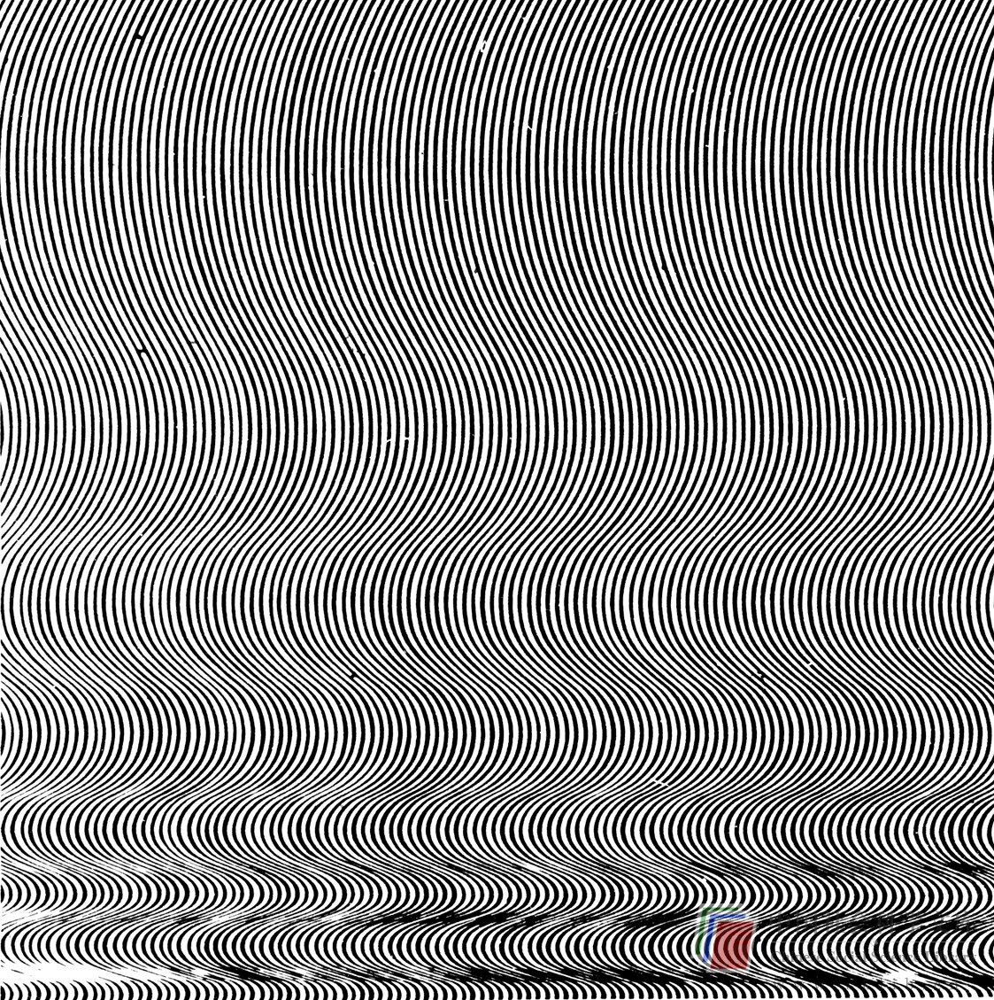
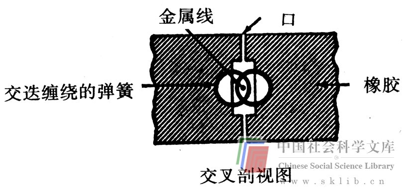

# 无意识排除障碍

在第二章，我们谈过无意识心理所起的关键作用和自我与超我对它的限制。在本章，我们目前已谈了冲破思维障碍的各种方法。通过使用各种形式的列单法，通过有意识地提出质疑，争取获得思维的敏捷性与灵活性，大大改进你的思维能力是完全可能的。这些方法之所以有效是因为它们发挥了人的有意识地、理智地解决问题的能力。我们将用此章剩余的篇幅来考虑如何削减自我与超我对无意识的限制。

提高你的思维能力的最有效的方法之一是第四章提到的避免过早定论。当一些想法试图上升到意识中时，自我与超我把它们判为不轨之念而压制下去。如果能够把这种定论暂时搁置一旁，便会有更多的想法得以保留下来，并能被“看清楚”。席勒在下面的论述中提到了过早定论的危险（摘自给朋友的一封信，载于《西格蒙德·弗洛伊德的基本著作》）。

“依我看来，你不满（没有创造力）的原因在于，你的理智对你的想象限制过多。我想在此发表一种看法，并用比喻来说明它。显然，理智在意识的入口处对涌进的想法审查过严，这很不好，因为这样做阻碍大脑的创造性活动。一种想法孤立看来可能无足轻重，甚至极端鲁莽，但是它可能会在另一个想法中体现出重要性；它以某种方式与其他看上去一样可笑的想法结合起来时，或许会起到一种非常有效的连接作用。除非理智能够保留所有的想法，直到把它们与其他想法联系起来考虑，理智是无法对这些想法作出判断的。在我看来，如果一个人的大脑富于创造力，那么一定是由于理智撤去了意识入口处的岗哨，众多的想法蜂拥而至，只有在这个时候理智才能检阅大量的想法。值得尊敬的评论家们，无论他们怎样称呼自己，他们畏惧真正的创造者所特有的转瞬即逝的狂热，这种狂热持续得久暂是区分善于思考与白日做梦的标准。你之所以无所成就、牢骚满腹，是因为你摒弃得太快，审视得过严。”

我们所受的教育使我们惯于严厉批判那些表面看来行不通、不切实际、轻率鲁莽、不甚完美或社会难容的想法，因此我们往往不愿向人承认自己有这样的想法，甚至对自己也不愿意。我们当然不愿意公开承认，我们可以考虑用羽毛做楼顶，或者把汽车换为轿椅来减少空气污染，或者甚至使海洛因合法化以减少犯罪。然而，如果我们真打算做一个有创造性的思想者，我们的头脑就应当能够想象出这些以及更为放任无羁的想法。那么，我们怎样推迟判断呢？我们可以有意识地凭藉理智来开始。如果我们能够经常有意识地让我们的自我放松一点，由此而来的产生新思想的成功就会使它进一步放松。我们来做一个在某种意义上是不断保持自我的游戏。做这个游戏的最简便方法是正式地（通过与自己或他人达成协议）设立一段推迟判断的时间。在一个人的情况下，我可以对自己说：“不错，我需要一些新想法，只花费少量时间来解决这个问题。为此，我必须推迟判断，看看我能产生什么想法。如果有时我的念头离奇古怪也不要紧，因为没人能知道我正忙于什么。”然后我无拘无束地构想，而不判断这些想法的实用性，这样做并没有使我的自我受到损害。最后，我要对自己正式宣布我将开始进行这个活动，因为它并不是我平常所习惯的心理行为。

推迟集体判断比推迟个人判断甚至可能更为有效，因为在集体中能够发展一种热情的态度，人们的想法可以相互激发。获得这种状态的一个极其著名的技巧是献策攻关法，这将在第八章中详细叙述。另一个鼓励推迟判断的有趣方法产生于马萨诸塞剑桥大学集体研究制小组早期的日子里。在威廉·戈赖（William J.J.Gordon）所写的《集体研究制》一书中详细描述了这一方法。

这一方法利用了比喻，采用四种类型的操作机制：个人类比、直接类比、象征类比和幻想类比。个人类比要求解决问题的人与这个问题的一部分或全部及其答案直接相关联。直接类比试图通过直接运用相应的事实、知识或其他东西来解决问题。象征类比除了在问题与客观的、非个人的对象或想象之间存在着一致以外，有些类似于个人类比。幻想类比允许解决问题的人利用幻想来解决问题。

最能说明怎样利用这种操作机制的办法是从戈顿的著作中摘引一段内容，下面的引文是在五个人之间的所谓集体研究制漫谈，他们面临的问题是为太空服发明一种幻想论证式的密封装置。这段引文开始时，这个集体刚刚结束讨论，讨论的问题是“在我们最无拘无束的幻想中，我们希望这个密封装置怎样起作用？”

幻想类比

> G：好，刚才的问题结束了。现在我们在这一点上需要采用一种疯狂的方法来理清这团乱麻。一个地地道道的异想天开的着眼点……一间有观测点的新房间！

> T：我们来想象一下，你可能希望这件太空服是封闭的……它会表现得正象你希望中要求的那样……（幻想类比机制）

> G：但愿能使它这样……

> F：嘘，好吧，愿望的实现，孩子气的梦……你希望它是封闭的，一种看不见的微生物为你工作，双手交叉放于开口的两边，把它拉紧……

> B：一条拉锁，有点象一只机械臭虫（直接类比机制），但并不是密封的……或足够强壮……

> G：我们怎样建立一个“希望——它——是——密封的”心理模型？

> R：你在说什么呢？

> B：他的意思是说，如果我们能够想象出在一个实际的模型中“希望——它——是——密封的”可能是怎样发生的——那么我们就……

> R：只剩下两天来产生一个足以成事的模型了，可你们这些家伙却在谈论孩子气的梦！让我们列出所有能够密封东西的方法吧。

> F：我讨厌列单子，这使我回到儿童时代，去买食品……

> R：F，如果我们有时间的话，我能理解你的间接方法，但现在快到这个最后期限了……而你却仍在谈什么希望的实现。

> G：世界上一切不中用的解决办法都是由于最后期限而被合理化的。

> T：经过训练的昆虫？

> D：什么？

> B：你的意思是，训练昆虫按照指令去关闭和打开？一、二、三开！听令！一、二、三关！

> F：有两排昆虫，密封装置的两侧各有一排——按照关闭的指令，它们都紧紧拉住手……或指头……或爪子……无论它们所有的什么……然后密封装置关紧了……

> G：我觉得象是一种海岸警卫队似的昆虫（个人类比机制）。

> D：不要介意我，说下去……

> G：你知道那个故事……冬日最恶劣的风暴——触礁的船……无法使用救生艇……一些沉不住气的男主角用牙齿紧咬住绳索游了出去……

> B：对不起，你已经有了一只昆虫开关密封装置，操纵那个小门闩……

> G：可我是在寻找一只为我进行关闭的精灵。当我想要这个密封装置被关闭时（幻想类比机制），变！它就被关上了！

> B：找到那只昆虫——能为你去关闭！

> R：假如你用一只蜘蛛……它会吐一条丝……将丝织成网（直接类比机制）。

> T：蜘蛛吐丝……把它交给跳蚤……密封装置上的小孔……跳蚤从这个孔跳进跳出，当它离开时，这个孔就关闭了……

> G：不错，但这些昆虫仅仅反映出一种低层次的能力。若是军队试验这类东西时，他们会用一寸宽的老虎钳夹住孔的两边，接着他们会用150磅的力量去拉它……你的那些笨蛋昆虫不得不按照指令去拽它们背后的钢丝……它们将不得不用钢来缝合。钢。（象征类比机制）

> B：我能找到一种方法来做这件事。比如那只拽着一条穿过这个孔的线的昆虫……你可以用机械的方法做这件事……同样的昆虫……放进同样的孔里……绕上一个象这样的弹簧……穿过孔一直到达那该死的密封装置……拧呀、拧呀、拧呀，……哎呀，废话！这太费时间了！还会把你该死的胳膊拧下来！

> G：可别放弃，也许还有另一种用钢缝合的办法……

> B：听着，我有另一种缝合的构想……你那条弹簧……用两个……我是说你有一个硬冲过去的长长的精灵……象这个样子……

> R：我明白他指的是什么……

> B：假如那个蹩脚的精灵是一条金属丝，我可以把它捅到那里，如果它有机会开始的话。它可以把所有东西都拽到一起……这些弹簧会被拉到一起，关闭那个孔……仅仅把它推上去……推——它将把橡胶孔边缘拉到一起……把弹簧嵌入橡胶……然后你就用钢缝合了它！

集体研究法使人员集体推迟了判断，因为这时他们愿意接受那种在一般情况下大概会因不切实际而予以摒弃的想法。他们可以这样做是因为集体研究法的规则告诉他们这样做。他们正在有效地使用一种至少是暂时地放松自我和超自我的看门狗职能，并使潜意识心理活动涌现到思想中的方法。无论是个人还是在集体内都可以使用这些方法，尽管集体的综合效应并没有起作用。同在集体里一样，假如你偶然想到用一块砖作一只热水瓶，利用砖的热吸收力这一想法会很快激发你想到其他类似的用途（如床的保温器、保温地板、夏威夷式地窖）。

但是，除了这些方法，改变无意识心理的自我调节方法又是怎样的呢？一般地说，有可能莫明其妙地放松自我和超自我控制，从而使人能够更好地利用这种潜意识心理吗？答案是肯定的，但并不简单，让我简短地回顾一下心理学的讨论，以便解释困难的原因。

如前面所谈到过的，尽管有许多理论解释了各种思维创新特征的理性过程，但并没有彻底的认识。许多心理学家都曾试图解释创造性思维和有创造性的人的动机与个性所必备的心理过程。