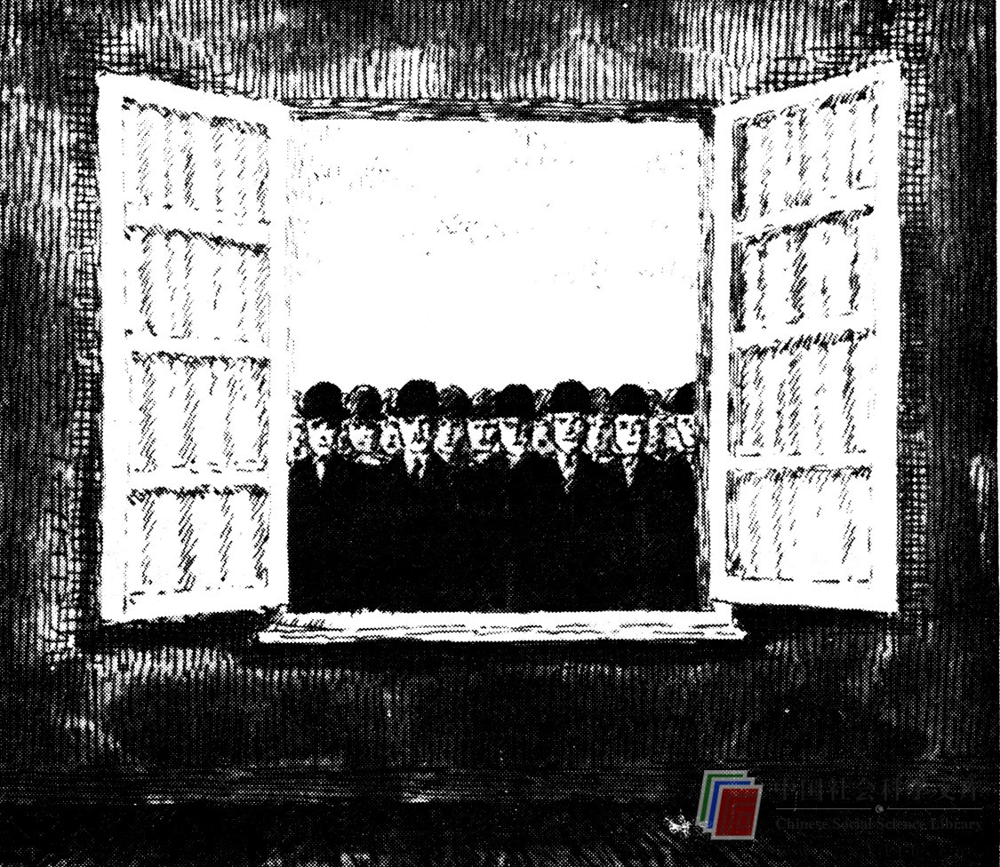

# 摆脱无意识的其它途径

没有其它的摆脱无意识的途径呢？大概有很多。马斯洛认为，一般说来，凡是能增进自我认识的方法，都必然会提高创造性。罗伯特·奥恩斯泰因（Robert Ornstein）在其著作《意识心理学》中所称的“传统的神秘主义心理学”，已在中近东文化中存在好几百年了。这类心理学涉及个人经验性的自我认识方法，而不涉及非个人的科学方法。这类心理学常常是从诸如佛教或瑜珈的修行中发展起来的，并利用反省之类的方法。这种方法专门用于尽可能暂时地减少线性逻辑思维，而强化某些属于无意识的心理过程。科学刚刚开始认识“直觉经验”和区分“意识的层次”。奥恩斯泰因相信，这种经验也许是这样一种例证，即在其中，分析性的左半脑停止对意识的通常的控制，使右半脑以非线性、非演绎的方式更自由地解释刺激。奥恩斯泰因在其著作中对这类心理学和方法同我们所熟悉的“右手型”心理学的结合提出了一个令人信服的观点。当然，随着提高对“左手型”思维的重视，必然会产生一种高度的自我认识。然而，在中近东所实践的这种方法费时费力；并且，尽管目前正在西方世界变得愈来愈流行，但我们许多人仍远不能或不愿用这种方法来提高自己的思维创新能力。

有什么途径能容易地使我们使用右手的西方人更好地摆脱无意识呢？马斯洛提出教育是一个途径，而我作为一个教育工作者而不是精神病学者或神秘主义者，当然深表赞同。马斯洛推测，尽管教育对于解除对“本能”和“被禁忌的冲动”的压抑无所作为，但它对整合初始过程和意识活动是相当有效的。关于心理过程和解决问题的知识，特别是对于人的自我的认识，能够放松人的自我抑制。其中所包含的道理是简单的：当事物被认识以后，它们便不可怕了。如果认识了恐惧的根源，恐惧便会减轻，并且大多数人的自我是有“悟性”的，完全可以放松一点——如果他们笃信其结果确有益处的话。

阅读是获得这种自我认识的最好途径之一。人们可以读到许多关于加强人的自尊、自信，使自己从不必要的恐惧和不安全感中摆脱出来的书籍和文章。假如你想进一步漫游下去的话，本书结尾的读者指南提供了一些关于创造性研究、心理学理论和“自我疗法”的出发点。研究创造性的书籍会使你更清楚地纵览人们对创造性思维和具有高度创造性的人的特征已有哪些了解。心理学理论书籍将帮助你认识人类的行为以及心理是怎样活动的。“自我疗法”书籍试图以你能够影响自己行为的方式来运用心理学理论。

了解你自己的心理活动，有点象掌握一种高尔夫球的击球动作。它允许你不断地以分步骤而有意识的方式改进你目前的动作。然而，就创造性思维来说，在对人的心理活动获得更多认识的过程中，还可以获得一种附带的益处。许多恐惧心理只有在同他人的比较之下才能维持下去。害怕提出问题往往意味着暴露了你对他人并不了解。当你明白了其他人也是无知的时候，这种恐惧便会消失。同样，当你得知其他人也有着类似的情感时，无论他们是否抑制它们，你在表达自己的感情时便不会有那么多的顾虑了。攻关献策方法之所以起作用，是因为其他人也有愚笨的想法。当你懂得很少有人能始终如一地在令人眼花缭乱的一闪念或纯粹的灵感中产生答案或解决办法时，你就更会愿意与问题做斗争。

因此，我鼓励你阅读。对思维进行思维是一项有趣的消遣。在这种消遣中，你能借助广泛的文献。它只会使你动脑筋的能力更强——关于心理学理论和创造性研究的完整知识必然有助于你提高创造性。我认为，只要能使我们的学生极其重视创造性，我们就会对他们的创造性发生一些影响。通过把创造性问题提高到课堂教学题目的地位来改变它的不为人知的状态，促使我们的学生在研究他们的其它学术课题时，赋予它同等的重要性，并感到他们实际上应当是更富有创造性的。

当然，阅读并不是搜集有关创造性和思维创新知识的唯一途径。你可以同那些致力于使人们自由地接近其无意识心理的心理学家和精神病学者谈话。你可以观察周围的人，并力求把他们的行为和思维过程与他们的创造性成果相互联系起来。在尝试使你的思维更富于创造力和效率的过程中，你也许会变得对自己的思维（在任何时候都是必然要做的）更有反省。

你应当从事的一项最重要活动是尽力摆脱你的无意识，以进行创造性的思维。如果你采取献策攻关法（或集体研究法），或仅仅是有意识地迫使自己变得富有创造性（通过列单子或无论其他什么方法），便会发生一件奇妙的事情。首先，你通常会发现你在世界上的任何事情上是否成功更多，而不是更少（因此你的某些耽忧是无根据的）。你还会发现，创造性思维对你变得更容易了。关于这一点是存在着心理学原因的。如果你利用你的无意识层，你的意识便会领悟到这种活动是有益的。如果某些来自无意识的结果产生了那种令自我十分着迷的成功，这种领悟便会大大加深。愈进行创造性思维，它就会变得愈自然和愈有收益，自我便愈放松。

