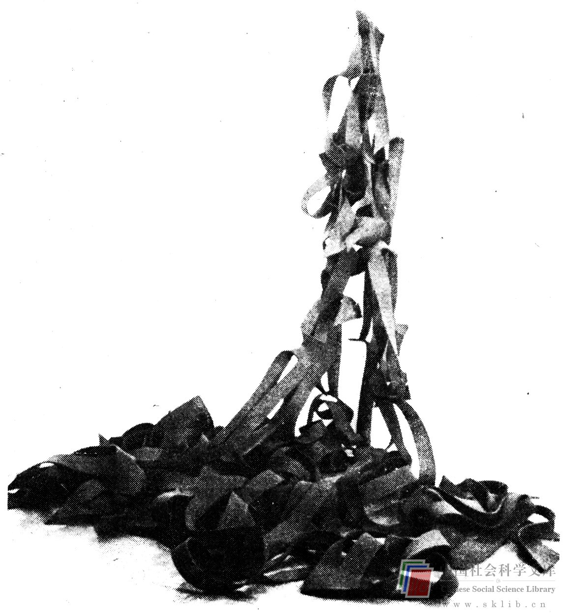

# 自我需要

自我需要时常可能为与从属需要相反的目标服务。它们促使个人去影响他人，去领导他人，去成为举足轻重的人，去出人头地。遗憾的是，在一个集体中变得举足轻重的最容易的办法就是做一个富于批评性的人。但正如我们早已看到的，批评的方法可能极不利于思维创新。

然而，同样有害的是那种被错误地指挥着的尝试，特别是一个影响着他人的（正式或非正式）的领导的尝试。最为自我所满意的影响方法并非总是对思维创新最有激励作用的。例如，运用权威是西方典型的影响他人的方法，而且发号施令的人对它可能感到十分惬意。我们所有的人都体验过权威，因为它广泛地为父母们所运用。权威有一些好处：它是立竿见影的，它对那些处于服从地位的人只需要最低限度的了解。

命令式影响方法的通常结果是，人们被相当精确地告知应该做什么。遗憾的是，这会减少去做任何其它事情的动力，这是一种对创造性的明显束服。命令式的领导往往愿意给他的下级以答案，而不是问题。另外，他们时常激起反抗。对于尽可能多地产生个人或集体的思维创新成果来说，反抗的气氛绝不是理想的。人们可能并不推翻统治者，而是以毫不动脑筋这个办法来反抗，他们可能在心理上“自我封闭”，不再能够多产地、创造性地做贡献。

相形之下，合作式的影响方法可能比较麻烦，但它鼓励思维创新。相互交流使人们更为不拘形式，每个成员都受到鼓励，并期望做出贡献，每个人都感到对集体冒险的成功有一种责任，从而在解决问题的过程中获得从属和自我需要的满足。

你认为哪种方法能使你得到最好的思维创新成果，权威式的还是合作式的？由于你是一个思考着的人（否则你不会正在读这本书），你大概会选择合作，那么你就对了。遗憾的是，由于合作式管理方法并不完全象命令式方法那样总能满足管理者的自我需要，故而它们在我们这个以自我为中心的文化中常常被忽视。

