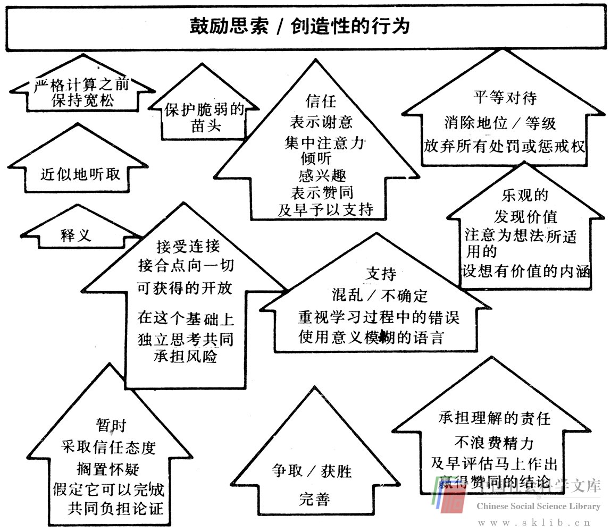
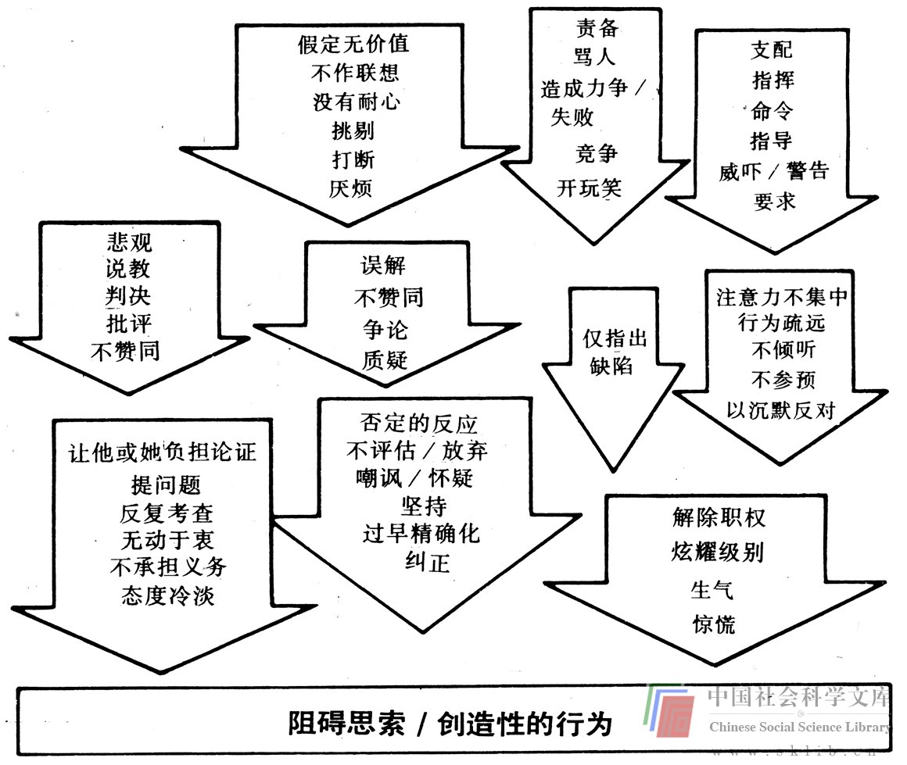

# 集体研究法

另一种解决问题的方法是由马萨诸塞州波士顿的集体研究社[1]开创的。这一方法比献策攻关法更为复杂，更为深奥，因为它允许批评和更高水平的技术专长，但却不允许参加者的自我需要危害思维创新过程。同献策攻关法一样，这一方法在解决问题时设立了集体的目标，从而给予参加者以通过解决该问题来满足其从属需要的机会。

在这种集体研究过程中，这个集体同需要解决问题的委托人一起工作，给这个委托人以充足的机会向这个集体提供信息输入。最初，委托人陈述问题，并挑选一些提出来的想法。集体研究制过程的一个特别值得人们注意的特征是，领导人对问题的解决方案并不直接做出贡献。领导是一个促进者和记录者，而不能提出他自己的想法——因为这样便可防止他以牺牲这个过程为代价来满足自我需要。

集体研究法与创新过程中的辅助性合作尤为有关。在这样做时，这一方法依赖于广泛多样的原理和技巧。如果需要一个新的概念，集体研究制便可采用如下所述的这种“集体漫谈”：

> 1. 领导要求委托人挑选一个直接目标或意愿，委托人想为这个目标开发出创新性的可能的解决方案。

> 2. 领导从这个目标或意愿中选出关键词（行为、概念）。

> 3. 领导要求集体（包括委托人）想出来自远离这个问题的领域的某个领域中那个关键词的实例。这个领域由领导选定，然后详细列出这个集体的实例清单。

> 4. 领导要求集体忘掉这个问题和目标或意愿，把注意力集中于被列出的每一实例，思考它们的联系，想象它们一呼即出，等等。要求集体成员在各自的本子上记下这些东西。

> 5. 领导要求集体利用他们全部或部分的实例材料，针对最初的目标或意愿，开发一种“荒谬可笑的想法”（可能是不实际、不可能或不合规则的）。

> 6. 领导要求从任何一个“荒谬可笑的想法”中集中发展出第二代想法（抽取出原理，以更现实的方式应用它们而不冲淡创新性）。

> 7. 领导要求委托人从第二代想法中挑选出有吸引力的想法。

> 8. 重新从问题的最初阶段开始，逐条列明委托人的反应。

然后，集体研究会议的大部分精力应投入到解决问题集体的动态过程中。下面的阐述取自集体研究社创始人乔治·普林斯的文章，说明了他认为在一个集体内什么是鼓励和阻碍创造性的行为类型。

一个集体研究会议的基调完全不同于一个献策攻关会。在献策攻关过程中，想法满天飞，参加者由于看到他们能产生出那么多富于想象力的想法而满足了从属需要和自我需要。在集体研究制中，只产生较少的想法，从属需要和自我需要是通过帮助解决委托人的问题而满足的。实际上，一个集体研究法的领导所必须具备的品质是，同那些想法尚未被挑选出来的集体成员优雅地打交道的能力。与集体研究会议相结合的一个有趣的技巧是采用一种评价方法。在这种方法中，在作出否定的陈述前，必须先至少作出两个肯定的陈述。这种肯定的陈述的作用是连续不断地向集体暗示委托人的愿望。然而，它们也使想法的发明者得到鼓励，并帮助保持一种能诱发创造性的心理气氛。批评（否定意见）的表达应被当作一种保留而不是一种毫无余地的表决。按照这种方法，颇为强烈的批评也可以被接受，却不会阻碍思维创新。

献策攻关和集体研究法这类方法对于集体解决问题之所以有效，原因在于它们是以减少思维创新阻碍的方式来处理从属和自我需要的。然而，一个集体无需这种正式的方式也能实现同样的目的——假如它认识了那些阻碍思维创新的因素的话。这种认识对于领导者来说是尤为重要的（不管领导是正式的还是非正式的），因为一个集体的领导处于一种既可支持又可压制思维创新的位置上。然而，如果所有成员共同具有这种认识的话，创新思维就会更为自由地涌现出来。