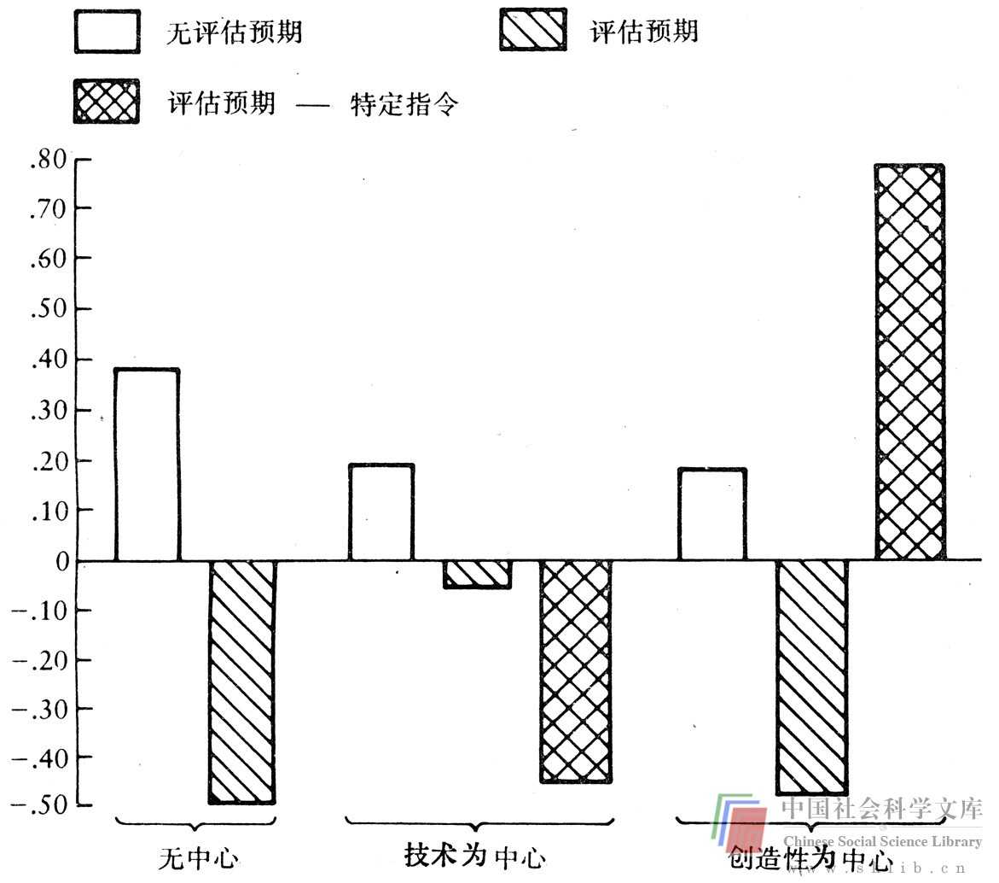

# 内在和外在动力

现在我们来谈一谈作为鼓励集体创造性的因素的动机和奖励这个十分重要的问题。当想到创造性时，我们不禁会想到历史上的杰出人物：列奥那多·达芬奇、莫扎特、爱因斯坦等等。如果我们探寻这种人的成就的原因，就会发现四个反复出现的话题。首先，他们的能力是非凡的。他们代表着社会科学家所喜欢提取的那种常态分布的最顶端部分。第二，他们异乎寻常地反抗社会对他们施加的约束力。尽管他们显然喜爱人们的喝彩，但他们主要是为自己的满足而工作。第三，他们不是得到富人赞助，就是拥有供养他们自己的必要财力，尽管他们主要致力于自己的追求。最后，他们全都专心致志于他们所热爱的工作。他们是内在地被驱动的，因为驱动他们的是他们自己对工作的兴趣而不是外在因素。

如果这些观点是正确的话，我们这些关心提高集体和组织的创造性的人就会产生一些疑虑了。集体和组织是否易于接纳这些无法用一般标准衡量的人，特别是它们是否对外界输入信号具有异乎寻常的免疫力？它们是否可能“资助”这种人，从而使他们正好能够去做自己所喜爱的事情？

内在动力与最高度的创造性是密切相关的，对这一点有大量令人信服的证据。特丽萨·Ｍ·阿马比尔（Teresa M.Amabile）的精采著作《创造性的社会心理学》（尽管是技术性的），以最令人信服的方法得出了这个观点。（就其全面地总结了有关创造性的心理学理论来说，这部著作也是杰出的。）作者对儿童和成人进行了诸如拼贴图案、讲故事和诗歌、填写动画片解说词等创造性工作的实验，并用一种她证明是可靠的评价系统来评判结果。她发现，当实验对象被内在地驱动时，最有创造性。外在驱动因素（评价、同行的注意、基于成果质量的奖励）则降低创造性。在这一著作中，她以大量数据支持了她的实验结论。

在一个典型的实验中，斯坦福大学一个心理学初级班所录取的95位妇女进行了拼贴图案的设计。她们不是艺术家，过去也没有任何拼贴活动方面的值得注意的经历。这种图案拼贴打算表达一种“纯朴”的感情。由15位人们一致承认其等级相当接近的艺术家来评价实验结果。

实验对象被任意地划分为8个组。3个组的实验对象被告知，设计本身并不重要（既没有评价的预期，也没有外在动力），唯一要注意的事情就是她们的情绪。其中第1组实验对象没有被给定任何进一步的主题，第2组被要求把注意力集中于“技巧的优良性”，第3组则被要求把注意力集中于创造性。

另外5组实验对象被告知，这项设计将由一个艺术家专门小组来评判，她们的拼贴将是实验数据的一部分（评价预期和外在动力）。同样地，第1组的实验对象没有被给定任何进一步的主题；第2组被告知将根据专家们对“技巧优良性”的评价来评判；第3组也被告知将根据拼贴在技巧上是否优良来评判，但另外还给定了评判时将予以考虑的六个具体技巧要点；第4组实验对象被告知将根据对其设计的创造性的评价来评判；第5组的实验对象不仅被告知将根据创造性来评价她们，而且评判时还将根据七项具体标准。

上图显示了各组所拼贴的图案的出色的创造性。在两个未被给定主题的组之间存在着较大的差异。未期望得到评价（内在动力）的实验对象的创造性平均得分高得多。三个以技术为中心的小组情况亦然。显然，对评价的期望也降低了那些仅被要求以创造性为中心的实验对象的创造性。然而，足以令人感兴趣的是，那些知道七个具体的创造性标准的人。被评为全体实验对象中最有创造性的。下面就这个问题再多谈几句，因为它是一个与本书的主旨相一致的发现。

从这些数据来看，情况似乎是：当受到内在的驱动时，当在一种评价和评判较少的气氛中工作时，我们更有创造性。是什么东西使我们在这种环境中努力工作呢？是我们对任务的内在的兴趣和入迷。这与那些未经证实的、同创造性研究有关的普遍看法相一致。这告诉了我们什么呢？它告诉我们，如果我们能够并确实重新安排我们的时间表，把更多的时间花在我们极感兴趣的事情上；如果我们有时间，有能使我们维持起码的生活的财力，我们就能增强我们的创造性。它告诉我们，集体和组织应当是更有创造性的（如果其中的个人被允许做同样的事情的话）。我们还应当付出特殊的努力，使人们进行竞赛，去从事那种被兴趣而不是被外在奖励所驱使的工作。

完全依赖于这种方法是否不利于创造性？有一个缺点，即它与一些关于组织的传统价值相违背。我们是从委派人们去做需要完成的工作这个角度来看待问题的，而必要的工作并不是最符合人们的兴趣的。清教徒的道德也向我们表明，工作也许应当具有某种要求外在奖励的性质。正如我父亲时常所说的：“假如工作是乐趣的话，就会有人因为无所事事而去做它。”另一个缺点是，即使假定工作是如此地令人愉快因而动力是内在的，我们大多数人也没有那种能使自己完全免于挨饿的财力。我所认识的人，无论过得好坏，都是生活中外在动力的老相识。我自己就是一个好例子。总的说来，我认为自己是极幸运的，因为我专心致志于给我带来巨大满足的活动。但是，给我带来愉快的工作比图案拼贴更为复杂，而我至今还无法在获得长期满足的同时逃避那种随之而来的单调乏味的短期苦役和精神上的折磨。因此，我不断同我完成这种苦役的时间表和记时钟做斗争。这种苦役当然不如我所能想到的各种选择（我的业余爱好、阅读无聊小说、做白日梦）那样令我惬意。我经常意识到我的收入和他人的看法。我受奖励的影响，并时常受到评价。我是否软弱？我是否应当告诉世人不要再来打扰我，找一个富有的资助人，在短期内专心致志于我最热爱的事情？我并不这样想。我担心从长远来看我会失败，我担心自己是否心智健全。那种给予我长期满足的事物需要短期的痛苦挣扎。我的价值观似乎是不赞成投富有的资助人的票。我生活在一个充满外在驱动力的世界里，在这样一个世界里，奖励是有效的，评价、不充裕的财力和同行的看法是生活的组成部分。

有关内在动力的启示是重要的，当我们在与集体和组织打交道时应切记在心。推动人们进行工作的内在动力（一种为兴趣而完成任务、奖励和评判次之的感受）多多益善。从新知识是提高创造性所必不可少的这个意义上（这是常有的情况）来说，学习本身就应当是令人感兴趣的。如果我们需要采用不熟悉的方法来解决问题，我们就应以一种能使解决问题过程变得令人兴奋的方式来利用这些方法。如果我们需要凭借奖励来增强动力，我们就应当巧妙一些，在包围着常人的现实世界中，奖励是必不可少的。我们大多数人并不打算增加生活中的风险和不确定因素，除非其中有某些对我们有利的东西。然而，奖励应当使我们对自己的创造性而不是只对劳动所得到的报酬感觉良好。成功的公司创建者们享受着他们的财富，然而我相信，他们是把财富作为一种同它所能买到的东西一样多的自身创造力的象征来享受的。我们总是欢迎对自己聪明才智的承认（金钱上或心理上的），它能增强我们的动力而变得更具创造性。对一次出色的打猎活动的奖励，即使我们也许没有获得猎物，也是意想不到的、令人高兴的。但是对成功的奖励是可以预料的，并不会改变我们的价值观。

最后，正如我在书中反复提示的，我们必须对评价和评分格外小心谨慎。它们不仅易于毁灭脆弱的新概念，而且似乎会熄灭创造性之火。在评价和评分不仅必不可少，而且几乎成为一种生活方式的集体和组织中，这一点尤为重要。

我还深信，广泛普及集体和组织解决问题过程的知识会带来好处。我认为，上图的最后一栏便说明了这一点。特莉萨·阿玛比尔对这一栏里的人（他们得到了特殊的创造性“指示”）的非同一般的创造性作了如下解释：

> 出于两个原因，对得到特定的创造性指示的小组的这种高度的创造性必须予以审慎的解释。通过精确地告诉人们创造性的成绩是由什么构成的，从而提高日常工作中的创造性，这在实际中是不大可能的。我们如此之高地评价关于创造性的研究的原因在于，我们无法预先得知究竟怎样获得新颖的、恰如其分的反应。从理论上来说，创造性概念的定义显然不允许把给定了特殊指示的任务看作是“创造性的”。按照创造性概念的定义，为了使任务规定的结果能被看作是创造性的，任务必须具有启发性（不存在正确答案或获得这种答案的已知方法）。在这项研究中，关于怎样制做一个将被评判为“创造性的”拼贴图案的特殊指示，使任务变得可以精确计算了。因此，按照这种概念定义，给这种有特殊指示的小组贴上“创造性的”标签是根本不恰当的。

我同意她对个人工作中的高度独创性概念的解释。但是，多数人周围的更为实际的状况是怎样的呢？必须使处于现实世界中的集体和组织接受的成果又是什么样的呢？依我看来，有理由认为在这种状况下，那些对创造性及其特征有更独特的理解的人会产生将被评判为更具创造性的成果，我们大多数人不是列奥那多·达芬奇、莫扎特或爱因斯坦；并且如果我们知道比赛规则的话，成绩就会更好。我们大多数人生活在一个充满外在动力的世界上，即使被给定了有关创造性的特殊信息，能制做出一幅被专家评判为具有创造性的拼贴图案也当然是令人高兴的。在大多数集体和组织中，外在奖励是关键性的，关于创造性的知识具有巨大的价值。