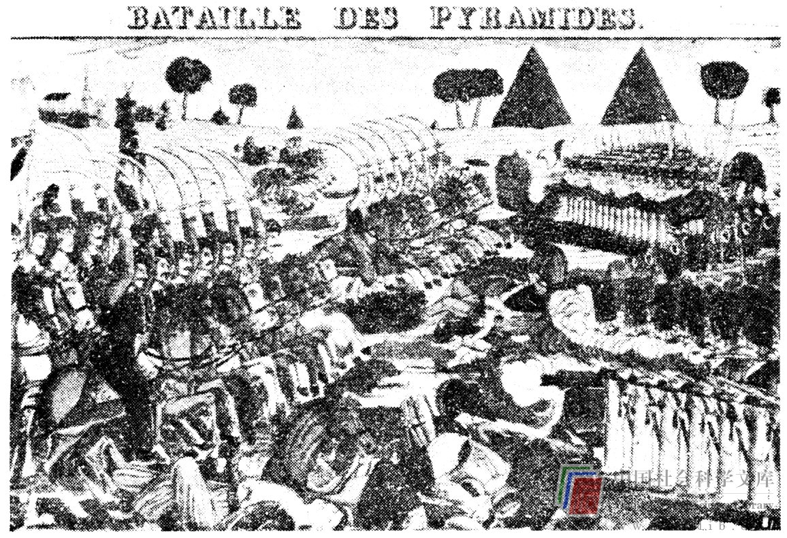

# 大组织：官僚主义的起源

以上我们已谈过了的在小集体情况下的思维创新的障碍，现在我们来考察较大的组织。集体若要有效地发挥作用，就得具有一定的规模，就需要一定类型的正式结构。例如非正式地集合起1万个人去迅速而经济地解决一个问题必然是困难的。这种正式结构的特征对于鼓励或阻碍在一个组织内的思维创新具有重要作用。考察这些特征的一个捷径是从历史上考察过去100年来的组织理论。

随着工业革命的发展和行政管理的日益复杂化，19世纪期间，组织的规模和数量迅速增大。19世纪末，理论家们开始研究大型组织，系统阐述增长了的生产力的原理。始作俑者之一是德国社会学家马克斯·韦伯（Max Weber），他在其著作《社会和经济组织理论》中概括了我们今天所谓的官僚主义的关键特征。韦伯认为官僚主义是大型的、复杂的活动的最终组织结构。他认为官僚政治是按照一套美妙的规则运行的。在这些规则中，个人从属于组织，而组织结构和纪律能产生一种程度极高的生产率。今天我们对于官僚主义可能多少抱着冷嘲热讽的态度。然而在韦伯的时代，强行贯彻官僚主义原则被看作是迈向秩序和效率的重大步骤。

20世纪初期在美国，弗里德里克·泰勒（Frederick Taylor）、路德·格里克（Luther Gulick）、兰道尔·厄威克（Lyndall Urwick）、亨利·法约尔（Henny Fayol）和其他人发展了一种在许多方面同韦伯的官僚主义理论相似的理论，这种理论被称为科学管理理论。它包括诸如统一指挥的等级式管理（每个人只有一个唯一的上司）和有限跨度管理（最初是不多于5个人向1个上司汇报工作）这类概念。科学管理是“自上而下”的，因为工作被规定得极为具体，而且是由上司向工人指定的，纪律和管理是集中式的，可以说科学管理是工作的设计与完成以及相应的行为举止整齐划一的标准化。同韦伯一样，科学管理的鼓吹者们认为，在组织内个人是完全可以替换的。

这一时期发表的一段引文更能说明问题，是Ｆ·Ｗ·泰勒对一个名叫施密特的钢铁工人所作的评论。泰勒致力于以一种将使产量最大化的方式来设计个人的工作。他设法重新设计施密特的工作，使他的产量（装运生铁锭）增加了大约360%。科学管理赞成报酬刺激制度，因此，由于劳动生产率的增长，施密特的工资增加了60%，这使他极为高兴，为这个故事添上了一个愉快的结局（工会在那个时代显然还没有占据支配地位）。泰勒后来对施密特作了如下的论述：“对于一个被训练以搬运生铁块为固定工作的人的最基本要求之一是，他将如此地感觉迟钝、如此无动于衷，以致比起其他任何什么来更象一头公牛。”

尽管科学管理对于人的看法是蒙昧落后的，在本世纪早期它却被广泛地接受。生产效率最大化运动波及许多生活领域（《一打儿更便宜》便是一个试图以这种方法养育家庭的故事）。纯粹的科学管理是高度组织化的，对工作有详尽的规定，要求任何人都不得违背他的工作规程。这种制度中的理想雇员是一部自动机器。它正是一种把人驱向常规化、重复、尽力缩小个人间差异的制度。科学管理是管理理论的一项创造性发展。它不是那种从工人那里寻求并获得创造性的管理方法。它当然是与质量循环管理方法大相径庭的。然而，对于20世纪早期以生产为导向的经济和大量非熟练的、未组织起来的劳动储备来说，它却是一种有效的制度。

