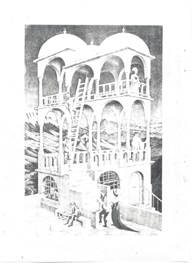

# 第三版说明

《突破思维的障碍》首次出版迄今已有十多年了。我愈益确信有意识地认识思维方面的障碍比我起初写作时所想象的更有价值。这个过程不仅本身有趣，而且还是提高创造性的有力手段。随着我们进入了80年代后期，思维和开发创造力的新方法日益明显地成为我们生活方式的自然组成部分。

出于许多充足的原因，我们的思维已经相当程序化，并具有各种十分发达的思维方式。因此我们都存在着思维上的障碍。然而，我们幸好具备有意识地改变自己解决问题的习惯的能力，它能使我们获得更富有创造性的结果。为此我们必须更清楚地了解解决问题的过程。对于我们在日常事务方面的习惯，我们需要变得持怀疑态度；如果我们应该改变这些习惯的话，还要学会更好地识别问题。我们需要更多地了解怎样创造性地解决问题，因为思维创新的障碍普遍存在，易于识别，经过努力是可以改进的。本书重点讨论心理障碍，并提供了达到这种自我认识的有效途径。

人人都想变得富有创造性（或自认为富有创造性），动力是不成问题的。对思维创新之障碍的了解只会增加你的动力，这仅仅是因为这些障碍与你的自我想象并不一致（谁？我？成见？绝不会！）。除了这种内在动力外，生活中还有更多的原因需要我们富于创造性。以对解决问题过程日益增加的了解和知识为基础的动力与有意识的干预相结合，是提高创造力的标准公式。本书对于帮助人们达到这一点来看是相当成功的，因此我不想对其内容作更大的改动。

对第三版，我更新了材料并增写了最后一章。特别是我对创造性的内在动力和外在动力的相互作用做了更多的讨论，因为我相信，要成为一个一贯出色的解决问题者，唯一途径就是既懂得如何创造又知道为何创造。

**詹姆斯 L·亚当斯**

**1985年10月15日**

